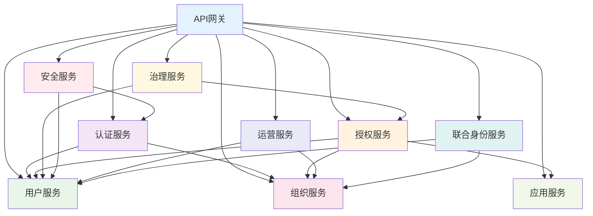
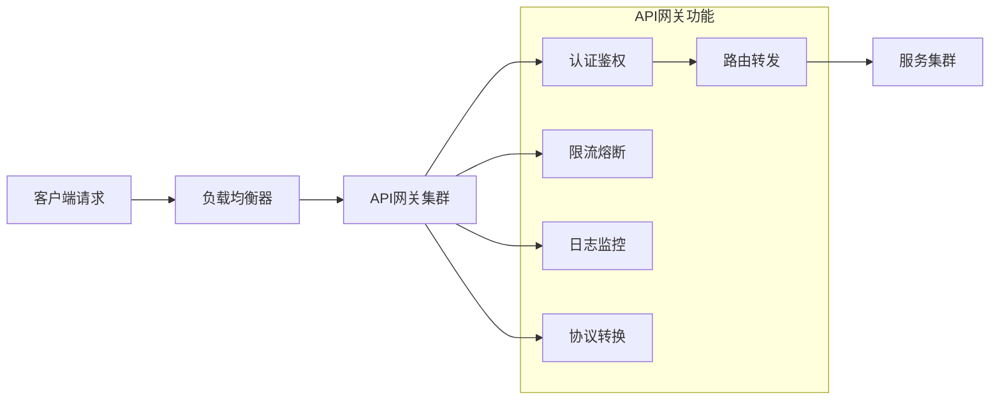

# IDaaS系统应用架构设计文档

## 1. 系统架构概述

### 1.1 架构设计理念
基于SpringBoot 3.5.10 + Vue3 + MySQL技术栈，采用微服务架构设计，构建高可用、可扩展的企业级IDaaS系统。架构遵循高内聚低耦合原则，通过服务拆分实现业务解耦，支持水平扩展和灰度发布。

### 1.2 核心设计原则
- **服务自治**：每个服务独立开发、部署、运维
- **容错设计**：通过熔断、限流、降级保障系统稳定性
- **可观测性**：完善的监控、日志、链路追踪能力
- **安全优先**：零信任安全架构，纵深防御体系

## 2. 微服务架构设计

### 2.1 服务拆分策略

#### 2.1.1 核心服务模块设计

**服务依赖关系图：**


#### 2.1.2 各服务详细设计

##### 2.1.2.1 用户管理服务（openidaas-user-service）
```
服务职责：
- 用户账户全生命周期管理
- 个人资料与扩展属性维护
- 密码策略执行与安全管理
- 用户状态变更处理

核心技术栈：
Spring Boot 3.5.10
Spring Data JPA + MyBatis-Plus
MySQL 8.0
Redis 7.0

核心接口：
POST /api/users          # 创建用户
GET /api/users/{id}      # 获取用户详情
PUT /api/users/{id}      # 更新用户信息
DELETE /api/users/{id}   # 删除用户
GET /api/users/search    # 用户搜索
```

##### 2.1.2.2 认证服务（openidaas-auth-service）
```
服务职责：
- 统一认证入口与协议适配
- 多因子认证支持
- 会话管理与令牌服务
- 自适应认证引擎

核心技术组件：
Spring Security 6.x
Spring Authorization Server
JWT Token处理
OAuth2.0/OpenID Connect

核心认证流程：
1. 凭据验证（用户名/密码）
2. MFA验证（根据策略决定）
3. 会话创建与Token生成
4. 风险评估与动态调整
```

##### 2.1.2.3 授权服务（openidaas-authz-service）
```
服务职责：
- RBAC/ABAC权限引擎
- 单点登录协议实现
- API网关与访问控制
- 动态权限计算

支持协议：
- OAuth2.0 Authorization Server
- OpenID Connect Provider
- SAML 2.0 Identity Provider
- CAS Server Protocol

权限模型：
- 基于角色的访问控制（RBAC）
- 基于属性的访问控制（ABAC）
- 时间/地点/设备上下文控制
```

### 2.2 服务间通信设计

#### 2.2.1 同步通信机制

**RESTful API设计规范：**
```java
@RestController
@RequestMapping("/api/users")
@Validated
public class UserController {
    
    @PostMapping
    @ResponseStatus(HttpStatus.CREATED)
    public ResponseEntity<UserDTO> createUser(@RequestBody @Valid CreateUserRequest request) {
        UserDTO user = userService.createUser(request);
        return ResponseEntity.created(URI.create("/api/users/" + user.getId())).body(user);
    }
    
    @GetMapping("/{id}")
    public ResponseEntity<UserDTO> getUserById(@PathVariable Long id) {
        return userService.findById(id)
            .map(ResponseEntity::ok)
            .orElse(ResponseEntity.notFound().build());
    }
}
```

**Feign客户端声明式调用：**
```java
@FeignClient(name = "user-service", configuration = FeignConfig.class)
public interface UserClient {
    
    @GetMapping("/api/users/{id}")
    ResponseEntity<UserDTO> getUserById(@PathVariable("id") Long id);
    
    @PostMapping("/api/users/_search")
    Page<UserDTO> searchUsers(@RequestBody UserSearchCriteria criteria);
}
```

#### 2.2.2 异步消息机制

**Kafka事件驱动架构：**
```java
@Component
public class UserEventProducer {
    
    @Autowired
    private KafkaTemplate<String, UserEvent> kafkaTemplate;
    
    public void publishUserCreatedEvent(User user) {
        UserEvent event = UserEvent.builder()
            .eventType(UserEventType.USER_CREATED)
            .userId(user.getId())
            .timestamp(Instant.now())
            .build();
            
        kafkaTemplate.send("user-events", user.getId().toString(), event);
    }
}

@Component
public class UserEventListener {
    
    @KafkaListener(topics = "user-events", groupId = "auth-group")
    public void handleUserEvent(ConsumerRecord<String, UserEvent> record) {
        UserEvent event = record.value();
        switch (event.getEventType()) {
            case USER_CREATED -> syncUserToAuthSystem(event.getUserId());
            case USER_UPDATED -> updateAuthUserInfo(event.getUserId());
            case USER_DELETED -> removeAuthUser(event.getUserId());
        }
    }
}
```

## 3. API网关设计

### 3.1 网关架构设计



### 3.2 Spring Cloud Gateway配置

```yaml
spring:
  cloud:
    gateway:
      routes:
        # 认证服务路由
        - id: auth-service
          uri: lb://openidaas-auth-service
          predicates:
            - Path=/api/auth/**
          filters:
            - StripPrefix=2
            - name: RequestRateLimiter
              args:
                redis-rate-limiter.replenishRate: 100
                redis-rate-limiter.burstCapacity: 200
            - name: CircuitBreaker
              args:
                name: authCircuitBreaker
                fallbackUri: forward:/fallback/auth
                
        # 用户服务路由
        - id: user-service
          uri: lb://openidaas-user-service
          predicates:
            - Path=/api/users/**
          filters:
            - StripPrefix=2
            - name: JwtAuthenticationFilter
            
        # 管理端点路由
        - id: management-api
          uri: lb://openidaas-management-service
          predicates:
            - Path=/api/admin/**
          filters:
            - StripPrefix=2
            - name: AdminAuthorizationFilter

      default-filters:
        - DedupeResponseHeader=Access-Control-Allow-Credentials Access-Control-Allow-Origin
        - SaveSession
        
      globalcors:
        cors-configurations:
          '[/**]':
            allowed-origin-patterns: "*"
            allowed-methods: "*"
            allowed-headers: "*"
            allow-credentials: true
```

## 4. 前端架构设计

### 4.1 前端技术架构

#### 4.1.1 技术栈选型
```
核心框架：Vue 3.4 + TypeScript 5.0
UI组件库：Element Plus 2.4
状态管理：Pinia 2.1
路由管理：Vue Router 4.2
HTTP客户端：Axios 1.6
构建工具：Vite 5.0
代码质量：ESLint + Prettier
```

#### 4.1.2 项目结构设计
```
src/
├── api/                    # API接口层
│   ├── auth.ts            # 认证相关接口
│   ├── user.ts            # 用户管理接口
│   └── system.ts          # 系统管理接口
├── assets/                # 静态资源
├── components/            # 通用组件
│   ├── layout/           # 布局组件
│   ├── form/             # 表单组件
│   └── chart/            # 图表组件
├── composables/           # Composition API逻辑复用
│   ├── useAuth.ts        # 认证逻辑
│   ├── usePermission.ts  # 权限控制
│   └── useTable.ts       # 表格操作
├── layouts/               # 页面布局
│   ├── default.vue       # 默认布局
│   └── auth.vue          # 认证布局
├── locales/               # 国际化配置
├── modules/               # 业务模块
│   ├── dashboard/        # 仪表板
│   ├── user/             # 用户管理
│   ├── system/           # 系统配置
│   └── monitor/          # 监控中心
├── pages/                 # 页面组件
├── plugins/               # 插件配置
├── router/                # 路由配置
├── stores/                # 状态管理
├── styles/                # 样式文件
├── types/                 # TypeScript类型定义
└── utils/                 # 工具函数
```

### 4.2 前端核心功能模块

#### 4.2.1 状态管理设计

```typescript
// stores/auth.ts
export const useAuthStore = defineStore('auth', () => {
  const user = ref<UserInfo | null>(null)
  const token = ref<string | null>(localStorage.getItem('access_token'))
  const permissions = ref<string[]>([])
  
  // 登录
  const login = async (credentials: LoginCredentials) => {
    try {
      const response = await authApi.login(credentials)
      token.value = response.data.access_token
      localStorage.setItem('access_token', token.value)
      await fetchUserInfo()
      return true
    } catch (error) {
      console.error('登录失败:', error)
      return false
    }
  }
  
  // 获取用户信息
  const fetchUserInfo = async () => {
    const response = await userApi.getCurrentUserInfo()
    user.value = response.data
    permissions.value = response.data.permissions || []
  }
  
  // 权限检查
  const hasPermission = (permission: string): boolean => {
    return permissions.value.includes(permission)
  }
  
  return {
    user,
    token,
    permissions,
    login,
    logout,
    fetchUserInfo,
    hasPermission,
    isAuthenticated: computed(() => !!token.value)
  }
})
```

#### 4.2.2 路由权限控制

```typescript
// router/index.ts
const router = createRouter({
  history: createWebHistory(),
  routes: [
    {
      path: '/login',
      component: () => import('@/pages/auth/Login.vue'),
      meta: { requiresAuth: false }
    },
    {
      path: '/dashboard',
      component: () => import('@/layouts/default.vue'),
      meta: { requiresAuth: true, permissions: ['dashboard:view'] },
      children: [
        {
          path: '',
          component: () => import('@/modules/dashboard/Index.vue')
        }
      ]
    }
  ]
})

// 路由守卫
router.beforeEach(async (to, from, next) => {
  const authStore = useAuthStore()
  
  if (to.meta.requiresAuth && !authStore.isAuthenticated) {
    next('/login')
    return
  }
  
  if (to.meta.permissions) {
    const hasPermission = to.meta.permissions.every((perm: string) => 
      authStore.hasPermission(perm)
    )
    if (!hasPermission) {
      next('/403')
      return
    }
  }
  
  next()
})
```

## 5. 数据访问层设计

### 5.1 数据库访问策略

#### 5.1.1 MyBatis-Plus集成配置

```java
@Configuration
@MapperScan("com.qoobot.openidaas.mapper")
public class MyBatisPlusConfig {
    
    @Bean
    public MybatisPlusInterceptor mybatisPlusInterceptor() {
        MybatisPlusInterceptor interceptor = new MybatisPlusInterceptor();
        
        // 分页插件
        interceptor.addInnerInterceptor(new PaginationInnerInterceptor(DbType.MYSQL));
        
        // 乐观锁插件
        interceptor.addInnerInterceptor(new OptimisticLockerInnerInterceptor());
        
        // 防全表更新删除插件
        interceptor.addInnerInterceptor(new BlockAttackInnerInterceptor());
        
        return interceptor;
    }
    
    @Bean
    public ConfigurationCustomizer configurationCustomizer() {
        return configuration -> configuration.setUseDeprecatedExecutor(false);
    }
}
```

#### 5.1.2 多数据源配置

```java
@Configuration
public class DataSourceConfig {
    
    @Bean
    @Primary
    @ConfigurationProperties("spring.datasource.master")
    public DataSource masterDataSource() {
        return DataSourceBuilder.create().build();
    }
    
    @Bean
    @ConfigurationProperties("spring.datasource.slave")
    public DataSource slaveDataSource() {
        return DataSourceBuilder.create().build();
    }
    
    @Bean
    public DynamicDataSource dynamicDataSource() {
        DynamicDataSource dynamicDataSource = new DynamicDataSource();
        Map<Object, Object> dataSourceMap = new HashMap<>();
        dataSourceMap.put("master", masterDataSource());
        dataSourceMap.put("slave", slaveDataSource());
        dynamicDataSource.setTargetDataSources(dataSourceMap);
        dynamicDataSource.setDefaultTargetDataSource(masterDataSource());
        return dynamicDataSource;
    }
}
```

### 5.2 缓存策略设计

#### 5.2.1 Redis缓存配置

```java
@Configuration
@EnableCaching
public class RedisConfig {
    
    @Bean
    public RedisTemplate<String, Object> redisTemplate(RedisConnectionFactory factory) {
        RedisTemplate<String, Object> template = new RedisTemplate<>();
        template.setConnectionFactory(factory);
        
        // 设置序列化器
        Jackson2JsonRedisSerializer<Object> serializer = 
            new Jackson2JsonRedisSerializer<>(Object.class);
        
        ObjectMapper mapper = new ObjectMapper();
        mapper.setVisibility(PropertyAccessor.ALL, JsonAutoDetect.Visibility.ANY);
        mapper.activateDefaultTyping(LazyCollectionResolver.instance, 
            ObjectMapper.DefaultTyping.NON_FINAL);
        serializer.setObjectMapper(mapper);
        
        template.setValueSerializer(serializer);
        template.setHashValueSerializer(serializer);
        template.setKeySerializer(new StringRedisSerializer());
        template.setHashKeySerializer(new StringRedisSerializer());
        
        template.afterPropertiesSet();
        return template;
    }
    
    @Bean
    public CacheManager cacheManager(RedisConnectionFactory factory) {
        RedisCacheConfiguration config = RedisCacheConfiguration.defaultCacheConfig()
            .entryTtl(Duration.ofHours(1))
            .serializeKeysWith(RedisSerializationContext.SerializationPair
                .fromSerializer(new StringRedisSerializer()))
            .serializeValuesWith(RedisSerializationContext.SerializationPair
                .fromSerializer(new GenericJackson2JsonRedisSerializer()));
                
        return RedisCacheManager.builder(factory)
            .cacheDefaults(config)
            .build();
    }
}
```

#### 5.2.2 缓存使用策略

```java
@Service
public class UserService {
    
    // 缓存用户信息（1小时过期）
    @Cacheable(value = "users", key = "#userId", unless = "#result == null")
    public User findById(Long userId) {
        return userMapper.selectById(userId);
    }
    
    // 更新时清除缓存
    @CacheEvict(value = "users", key = "#user.id")
    @Transactional
    public void updateUser(User user) {
        userMapper.updateById(user);
    }
    
    // 批量操作清除缓存
    @CacheEvict(value = "users", allEntries = true)
    @Transactional
    public void batchUpdateUsers(List<User> users) {
        userMapper.updateBatch(users);
    }
}
```

## 6. 安全架构设计

### 6.1 认证授权体系

#### 6.1.1 JWT Token设计

```java
@Component
public class JwtTokenProvider {
    
    @Value("${app.jwt.secret}")
    private String jwtSecret;
    
    @Value("${app.jwt.expiration}")
    private long jwtExpiration;
    
    public String generateToken(Authentication authentication) {
        UserDetails userDetails = (UserDetails) authentication.getPrincipal();
        
        Date now = new Date();
        Date expiryDate = new Date(now.getTime() + jwtExpiration);
        
        return Jwts.builder()
            .setSubject(userDetails.getUsername())
            .setIssuedAt(new Date())
            .setExpiration(expiryDate)
            .signWith(SignatureAlgorithm.HS512, jwtSecret)
            .claim("authorities", userDetails.getAuthorities())
            .compact();
    }
    
    public boolean validateToken(String token) {
        try {
            Jwts.parser().setSigningKey(jwtSecret).parseClaimsJws(token);
            return true;
        } catch (JwtException | IllegalArgumentException e) {
            return false;
        }
    }
}
```

#### 6.1.2 OAuth2.0授权服务器配置

```java
@Configuration
@EnableAuthorizationServer
public class AuthorizationServerConfig extends AuthorizationServerConfigurerAdapter {
    
    @Autowired
    private AuthenticationManager authenticationManager;
    
    @Autowired
    private UserDetailsService userDetailsService;
    
    @Autowired
    private DataSource dataSource;
    
    @Override
    public void configure(ClientDetailsServiceConfigurer clients) throws Exception {
        clients.jdbc(dataSource)
            .withClient("web-client")
            .secret(passwordEncoder().encode("web-secret"))
            .authorizedGrantTypes("authorization_code", "refresh_token")
            .scopes("read", "write")
            .redirectUris("http://localhost:8080/callback");
    }
    
    @Override
    public void configure(AuthorizationServerEndpointsConfigurer endpoints) {
        endpoints
            .authenticationManager(authenticationManager)
            .userDetailsService(userDetailsService)
            .tokenStore(tokenStore())
            .accessTokenConverter(accessTokenConverter());
    }
}
```

### 6.2 安全防护措施

#### 6.2.1 Web安全配置

```java
@Configuration
@EnableWebSecurity
public class SecurityConfig {
    
    @Bean
    public SecurityFilterChain filterChain(HttpSecurity http) throws Exception {
        http
            .cors().and().csrf().disable()
            .sessionManagement()
                .sessionCreationPolicy(SessionCreationPolicy.STATELESS)
            .and()
            .authorizeHttpRequests(authz -> authz
                .requestMatchers("/api/public/**").permitAll()
                .requestMatchers("/api/auth/**").permitAll()
                .requestMatchers("/api/admin/**").hasRole("ADMIN")
                .anyRequest().authenticated()
            )
            .addFilterBefore(jwtAuthenticationFilter(), UsernamePasswordAuthenticationFilter.class)
            .exceptionHandling()
                .authenticationEntryPoint(unauthorizedHandler)
                .accessDeniedHandler(accessDeniedHandler);
                
        return http.build();
    }
}
```

#### 6.2.2 API安全防护

```java
@Component
public class ApiSecurityInterceptor implements HandlerInterceptor {
    
    @Override
    public boolean preHandle(HttpServletRequest request, 
                           HttpServletResponse response, 
                           Object handler) throws Exception {
        
        // API签名验证
        String signature = request.getHeader("X-API-Signature");
        String timestamp = request.getHeader("X-Timestamp");
        String nonce = request.getHeader("X-Nonce");
        
        if (!validateSignature(signature, timestamp, nonce, request)) {
            response.setStatus(HttpStatus.UNAUTHORIZED.value());
            return false;
        }
        
        // 速率限制检查
        if (!rateLimiter.tryAcquire(request.getRemoteAddr())) {
            response.setStatus(HttpStatus.TOO_MANY_REQUESTS.value());
            return false;
        }
        
        return true;
    }
}
```

## 7. 部署架构设计

### 7.1 容器化部署方案

#### 7.1.1 Docker镜像构建

```dockerfile
# 多阶段构建
FROM openjdk:21-jdk-slim AS builder
WORKDIR /app
COPY . .
RUN ./mvnw clean package -DskipTests

FROM openjdk:21-jre-slim
WORKDIR /app

# 创建运行用户
RUN addgroup --system appgroup && \
    adduser --system --group appuser && \
    chown -R appuser:appgroup /app

USER appuser

# 复制应用文件
COPY --from=builder /app/target/*.jar app.jar
COPY --from=builder /app/wait-for-it.sh .

# 健康检查
HEALTHCHECK --interval=30s --timeout=3s --start-period=60s --retries=3 \
    CMD curl -f http://localhost:8080/actuator/health || exit 1

EXPOSE 8080
ENTRYPOINT ["./wait-for-it.sh", "db:3306", "--", "java", "-jar", "app.jar"]
```

#### 7.1.2 Kubernetes部署配置

```yaml
# deployment.yaml
apiVersion: apps/v1
kind: Deployment
metadata:
  name: openidaas-auth-service
  labels:
    app: auth-service
spec:
  replicas: 3
  selector:
    matchLabels:
      app: auth-service
  template:
    metadata:
      labels:
        app: auth-service
    spec:
      containers:
      - name: auth-service
        image: registry.example.com/openidaas/auth-service:latest
        ports:
        - containerPort: 8080
        envFrom:
        - configMapRef:
            name: auth-service-config
        - secretRef:
            name: auth-service-secrets
        resources:
          requests:
            memory: "512Mi"
            cpu: "250m"
          limits:
            memory: "1Gi"
            cpu: "500m"
        readinessProbe:
          httpGet:
            path: /actuator/health/readiness
            port: 8080
          initialDelaySeconds: 30
          periodSeconds: 10
        livenessProbe:
          httpGet:
            path: /actuator/health/liveness
            port: 8080
          initialDelaySeconds: 60
          periodSeconds: 30
---
# service.yaml
apiVersion: v1
kind: Service
metadata:
  name: auth-service
spec:
  selector:
    app: auth-service
  ports:
  - protocol: TCP
    port: 80
    targetPort: 8080
  type: ClusterIP
```

### 7.2 高可用设计

#### 7.2.1 数据库高可用

```yaml
# mysql主从复制配置
apiVersion: apps/v1
kind: StatefulSet
metadata:
  name: mysql-master
spec:
  serviceName: "mysql-master"
  replicas: 1
  selector:
    matchLabels:
      app: mysql-master
  template:
    metadata:
      labels:
        app: mysql-master
    spec:
      containers:
      - name: mysql
        image: mysql:8.0
        env:
        - name: MYSQL_ROOT_PASSWORD
          valueFrom:
            secretKeyRef:
              name: mysql-secret
              key: root-password
        ports:
        - containerPort: 3306
        volumeMounts:
        - name: mysql-data
          mountPath: /var/lib/mysql
  volumeClaimTemplates:
  - metadata:
      name: mysql-data
    spec:
      accessModes: ["ReadWriteOnce"]
      resources:
        requests:
          storage: 100Gi
---
apiVersion: apps/v1
kind: Deployment
metadata:
  name: mysql-slave
spec:
  replicas: 2
  selector:
    matchLabels:
      app: mysql-slave
  template:
    metadata:
      labels:
        app: mysql-slave
    spec:
      containers:
      - name: mysql
        image: mysql:8.0
        env:
        - name: MYSQL_ROOT_PASSWORD
          valueFrom:
            secretKeyRef:
              name: mysql-secret
              key: root-password
        - name: MYSQL_MASTER_HOST
          value: "mysql-master"
```

#### 7.2.2 负载均衡配置

```yaml
# ingress.yaml
apiVersion: networking.k8s.io/v1
kind: Ingress
metadata:
  name: openidaas-ingress
  annotations:
    nginx.ingress.kubernetes.io/rewrite-target: /
    nginx.ingress.kubernetes.io/rate-limit: "100"
spec:
  rules:
  - host: idaas.example.com
    http:
      paths:
      - path: /api/auth
        pathType: Prefix
        backend:
          service:
            name: auth-service
            port:
              number: 80
      - path: /api/users
        pathType: Prefix
        backend:
          service:
            name: user-service
            port:
              number: 80
  tls:
  - hosts:
    - idaas.example.com
    secretName: idaas-tls-secret
```

## 8. 监控运维体系

### 8.1 监控指标设计

#### 8.1.1 应用指标收集

```java
@Component
public class CustomMetrics {
    
    private final MeterRegistry meterRegistry;
    private final Counter userLoginCounter;
    private final Timer authProcessingTimer;
    private final Gauge activeSessionsGauge;
    
    public CustomMetrics(MeterRegistry meterRegistry) {
        this.meterRegistry = meterRegistry;
        
        userLoginCounter = Counter.builder("user.login.count")
            .description("用户登录次数")
            .tag("service", "auth-service")
            .register(meterRegistry);
            
        authProcessingTimer = Timer.builder("auth.processing.time")
            .description("认证处理耗时")
            .tag("service", "auth-service")
            .register(meterRegistry);
            
        activeSessionsGauge = Gauge.builder("active.sessions")
            .description("活跃会话数")
            .tag("service", "auth-service")
            .register(meterRegistry, this, CustomMetrics::getActiveSessionCount);
    }
    
    public void recordLogin() {
        userLoginCounter.increment();
    }
    
    public Timer.Sample startAuthTimer() {
        return Timer.start(meterRegistry);
    }
    
    public void stopAuthTimer(Timer.Sample sample) {
        sample.stop(authProcessingTimer);
    }
}
```

#### 8.1.2 日志架构设计

```xml
<!-- logback-spring.xml -->
<configuration>
    <springProfile name="default">
        <appender name="CONSOLE" class="ch.qos.logback.core.ConsoleAppender">
            <encoder>
                <pattern>%d{yyyy-MM-dd HH:mm:ss.SSS} [%thread] %-5level [%X{traceId:-N/A}] %logger{36} - %msg%n</pattern>
            </encoder>
        </appender>
        <root level="INFO">
            <appender-ref ref="CONSOLE"/>
        </root>
    </springProfile>
    
    <springProfile name="prod">
        <appender name="FILE" class="ch.qos.logback.core.rolling.RollingFileAppender">
            <file>/var/log/openidaas/app.log</file>
            <rollingPolicy class="ch.qos.logback.core.rolling.TimeBasedRollingPolicy">
                <fileNamePattern>/var/log/openidaas/app.%d{yyyy-MM-dd}.%i.gz</fileNamePattern>
                <maxFileSize>100MB</maxFileSize>
                <maxHistory>30</maxHistory>
                <totalSizeCap>10GB</totalSizeCap>
            </rollingPolicy>
            <encoder>
                <pattern>%d{yyyy-MM-dd HH:mm:ss.SSS} [%thread] %-5level [%X{traceId:-N/A}] %logger{36} [%X{userId:-anonymous}] - %msg%n</pattern>
            </encoder>
        </appender>
        
        <appender name="ASYNC" class="ch.qos.logback.classic.AsyncAppender">
            <discardingThreshold>0</discardingThreshold>
            <queueSize>512</queueSize>
            <includeCallerData>false</includeCallerData>
            <appender-ref ref="FILE"/>
        </appender>
        
        <root level="WARN">
            <appender-ref ref="ASYNC"/>
        </root>
    </springProfile>
</configuration>
```

### 8.2 告警机制设计

```yaml
# alert-rules.yaml
groups:
- name: idaas-alerts
  rules:
  - alert: HighErrorRate
    expr: rate(http_requests_total{status=~"5.."}[5m]) > 0.05
    for: 2m
    labels:
      severity: warning
    annotations:
      summary: "High error rate detected"
      description: "{{ $labels.service }} error rate is {{ $value }}%"
      
  - alert: HighLatency
    expr: histogram_quantile(0.95, http_request_duration_seconds_bucket) > 2
    for: 5m
    labels:
      severity: critical
    annotations:
      summary: "High latency detected"
      description: "{{ $labels.service }} 95th percentile latency is {{ $value }}s"
      
  - alert: LowAvailableMemory
    expr: node_memory_available_bytes / node_memory_total_bytes < 0.1
    for: 3m
    labels:
      severity: warning
    annotations:
      summary: "Low available memory"
      description: "Available memory is below 10%"
```

## 9. 性能优化方案

### 9.1 数据库优化

#### 9.1.1 索引优化策略

```sql
-- 用户表复合索引
CREATE INDEX idx_user_status_created ON users(status, created_at);
CREATE INDEX idx_user_email_status ON users(email, status);
CREATE INDEX idx_user_mobile_status ON users(mobile, status);

-- 权限表优化索引
CREATE INDEX idx_role_perm_role ON role_permissions(role_id);
CREATE INDEX idx_role_perm_perm ON role_permissions(perm_id);
CREATE INDEX idx_user_role_user ON user_roles(user_id);
CREATE INDEX idx_user_role_role ON user_roles(role_id);

-- 审计日志分区表
CREATE TABLE audit_logs (
    id BIGINT PRIMARY KEY AUTO_INCREMENT,
    user_id BIGINT,
    action VARCHAR(64),
    log_time TIMESTAMP DEFAULT CURRENT_TIMESTAMP,
    INDEX idx_user_time (user_id, log_time),
    INDEX idx_action_time (action, log_time)
) PARTITION BY RANGE (YEAR(log_time)) (
    PARTITION p2024 VALUES LESS THAN (2025),
    PARTITION p2025 VALUES LESS THAN (2026),
    PARTITION p_future VALUES LESS THAN MAXVALUE
);
```

#### 9.1.2 查询优化

```java
@Repository
public interface UserRepository extends JpaRepository<User, Long> {
    
    // 使用投影接口减少数据传输
    @Query("SELECT u.id as id, u.username as username, u.email as email, " +
           "u.status as status, u.createdAt as createdAt " +
           "FROM User u WHERE u.status = :status")
    List<UserProjection> findByStatusProjected(@Param("status") Integer status);
    
    // 批量查询优化
    @Query("SELECT u FROM User u JOIN FETCH u.roles WHERE u.id IN :ids")
    List<User> findByIdsWithRoles(@Param("ids") List<Long> ids);
    
    // 分页查询优化
    @Query(value = "SELECT * FROM users WHERE status = :status ORDER BY created_at DESC",
           countQuery = "SELECT COUNT(*) FROM users WHERE status = :status")
    Page<User> findByStatusWithPagination(@Param("status") Integer status, Pageable pageable);
}
```

### 9.2 缓存优化策略

#### 9.2.1 多级缓存设计

```java
@Service
public class CachedUserService {
    
    @Autowired
    private RedisTemplate<String, Object> redisTemplate;
    
    @Autowired
    private UserService userService;
    
    // 一级缓存：本地缓存（Caffeine）
    private final Cache<String, User> localCache = Caffeine.newBuilder()
        .maximumSize(1000)
        .expireAfterWrite(5, TimeUnit.MINUTES)
        .build();
    
    // 二级缓存：Redis分布式缓存
    public User getUserById(Long userId) {
        String cacheKey = "user:" + userId;
        
        // 先查本地缓存
        User user = localCache.getIfPresent(cacheKey);
        if (user != null) {
            return user;
        }
        
        // 再查Redis缓存
        user = (User) redisTemplate.opsForValue().get(cacheKey);
        if (user != null) {
            localCache.put(cacheKey, user); // 回填本地缓存
            return user;
        }
        
        // 查数据库
        user = userService.findById(userId);
        if (user != null) {
            redisTemplate.opsForValue().set(cacheKey, user, 1, TimeUnit.HOURS);
            localCache.put(cacheKey, user);
        }
        
        return user;
    }
}
```

## 10. 总结

本应用架构设计文档详细阐述了IDaaS系统的整体架构方案，通过微服务拆分、前后端分离、安全防护、监控运维等多个维度，构建了一个高可用、可扩展、安全可靠的企业级身份管理平台。

### 10.1 架构优势
- **高内聚低耦合**：服务拆分合理，职责清晰
- **弹性伸缩**：支持水平扩展和自动扩缩容
- **安全可靠**：多层次安全防护和零信任架构
- **可观测性强**：完善的监控告警和日志体系

### 10.2 实施建议
1. 分阶段实施，优先核心功能
2. 建立完善的自动化测试体系
3. 制定详细的监控和运维规范
4. 持续优化性能和用户体验