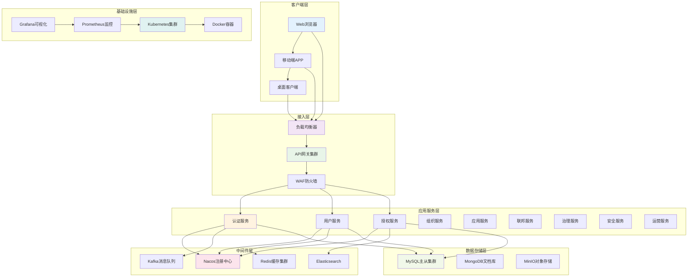
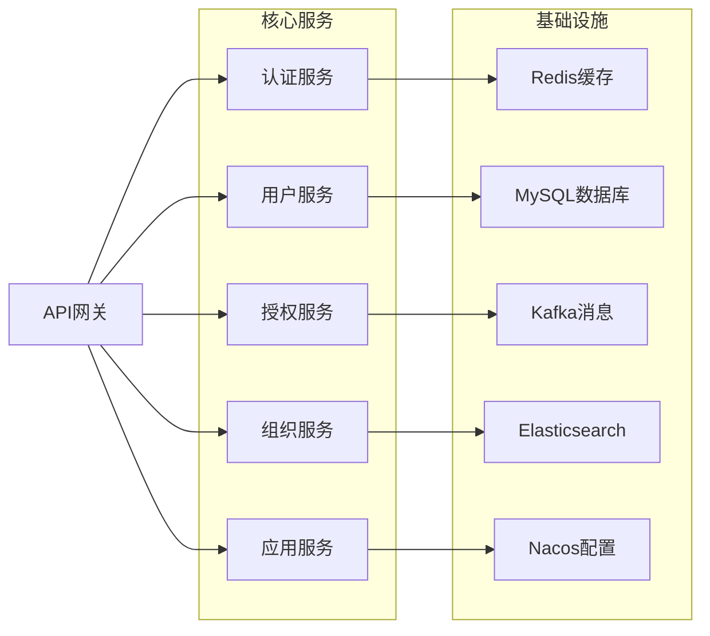

# IDaaS系统技术架构设计文档

## 1. 技术架构概述

### 1.1 架构设计理念
基于SpringBoot 3.5.10 + JDK 21 + Vue3 + MySQL的现代化技术栈，构建高可用、高性能、易扩展的企业级IDaaS系统。采用微服务架构、容器化部署、云原生技术，确保系统的可靠性、安全性和可维护性。

### 1.2 核心技术选型

#### 1.2.1 后端技术栈
```
核心框架：
- Spring Boot 3.5.10 (JDK 21支持)
- Spring Security 6.x (新一代安全框架)
- Spring Authorization Server (OAuth2.1/OIDC实现)
- Spring Cloud 2023.x (微服务治理)

数据访问：
- MyBatis-Plus 3.5.7 (ORM框架)
- Spring Data JPA (领域驱动设计)
- HikariCP (高性能连接池)
- Redis 7.0 (分布式缓存)

中间件：
- Apache Kafka (消息队列)
- Nacos (服务注册发现)
- Elasticsearch (搜索引擎)
```

#### 1.2.2 前端技术栈
```
核心框架：
- Vue 3.4 (渐进式框架)
- TypeScript 5.0 (类型安全)
- Vite 5.0 (构建工具)

UI组件：
- Element Plus 2.4 (桌面端组件库)
- Pinia 2.1 (状态管理)
- Vue Router 4.2 (路由管理)

工程化：
- ESLint/Prettier (代码质量)
- Vitest (单元测试)
- Cypress (端到端测试)
```

## 2. 系统架构图

### 2.1 整体架构拓扑



### 2.2 微服务架构分解



## 3. 核心组件详细设计

### 3.1 后端核心组件

#### 3.1.1 统一认证中心

```java
@Configuration
@EnableWebSecurity
@EnableMethodSecurity
public class SecurityConfig {
    
    @Bean
    public SecurityFilterChain filterChain(HttpSecurity http) throws Exception {
        http
            .cors(Customizer.withDefaults())
            .csrf(csrf -> csrf.disable())
            .sessionManagement(session -> 
                session.sessionCreationPolicy(SessionCreationPolicy.STATELESS))
            .authorizeHttpRequests(authz -> authz
                .requestMatchers("/api/public/**").permitAll()
                .requestMatchers("/api/auth/**").permitAll()
                .requestMatchers("/api/admin/**").hasRole("ADMIN")
                .anyRequest().authenticated()
            )
            .oauth2ResourceServer(oauth2 -> 
                oauth2.jwt(jwt -> jwt.decoder(jwtDecoder())))
            .addFilterBefore(jwtAuthenticationFilter(), 
                UsernamePasswordAuthenticationFilter.class);
            
        return http.build();
    }
    
    @Bean
    public JwtDecoder jwtDecoder() {
        SecretKeySpec key = new SecretKeySpec(
            jwtProperties.getSecret().getBytes(), "HmacSHA256");
        return NimbusJwtDecoder.withSecretKey(key).build();
    }
}

@RestController
@RequestMapping("/api/auth")
public class AuthController {
    
    @PostMapping("/login")
    public ResponseEntity<LoginResponse> login(@RequestBody @Valid LoginRequest request) {
        Authentication authentication = authenticationManager
            .authenticate(new UsernamePasswordAuthenticationToken(
                request.getUsername(), request.getPassword()));
                
        String accessToken = jwtTokenProvider.generateAccessToken(authentication);
        String refreshToken = jwtTokenProvider.generateRefreshToken(authentication);
        
        return ResponseEntity.ok(LoginResponse.builder()
            .accessToken(accessToken)
            .refreshToken(refreshToken)
            .expiresIn(jwtProperties.getAccessTokenValidity())
            .tokenType("Bearer")
            .build());
    }
}
```

#### 3.1.2 OAuth2.0授权服务器

```java
@Configuration
@EnableAuthorizationServer
public class AuthorizationServerConfig {
    
    @Bean
    public RegisteredClientRepository registeredClientRepository() {
        RegisteredClient registeredClient = RegisteredClient.withId("web-client")
            .clientId("web-client")
            .clientSecret("{noop}web-secret")
            .clientAuthenticationMethod(ClientAuthenticationMethod.CLIENT_SECRET_BASIC)
            .authorizationGrantType(AuthorizationGrantType.AUTHORIZATION_CODE)
            .authorizationGrantType(AuthorizationGrantType.REFRESH_TOKEN)
            .redirectUri("http://127.0.0.1:8080/login/oauth2/code/messaging-client-oidc")
            .postLogoutRedirectUri("http://127.0.0.1:8080/")
            .scope("openid")
            .scope("profile")
            .scope("message.read")
            .scope("message.write")
            .clientSettings(ClientSettings.builder()
                .requireAuthorizationConsent(true).build())
            .tokenSettings(TokenSettings.builder()
                .accessTokenTimeToLive(Duration.ofHours(1))
                .refreshTokenTimeToLive(Duration.ofDays(30))
                .build())
            .build();
            
        return new InMemoryRegisteredClientRepository(registeredClient);
    }
    
    @Bean
    public JWKSource<SecurityContext> jwkSource() {
        RSAKey rsaKey = Jwks.generateRsa();
        JWKSet jwkSet = new JWKSet(rsaKey);
        return (jwkSelector, securityContext) -> jwkSelector.select(jwkSet);
    }
}
```

#### 3.1.3 分布式缓存系统

```java
@Configuration
@EnableCaching
public class RedisConfig {
    
    @Bean
    public RedisTemplate<String, Object> redisTemplate(RedisConnectionFactory factory) {
        RedisTemplate<String, Object> template = new RedisTemplate<>();
        template.setConnectionFactory(factory);
        
        // 使用FastJSON序列化
        FastJsonRedisSerializer<Object> serializer = new FastJsonRedisSerializer<>(Object.class);
        
        template.setValueSerializer(serializer);
        template.setHashValueSerializer(serializer);
        template.setKeySerializer(new StringRedisSerializer());
        template.setHashKeySerializer(new StringRedisSerializer());
        
        template.afterPropertiesSet();
        return template;
    }
    
    @Bean
    public CacheManager cacheManager(RedisConnectionFactory factory) {
        RedisCacheConfiguration config = RedisCacheConfiguration.defaultCacheConfig()
            .entryTtl(Duration.ofHours(1))
            .serializeKeysWith(RedisSerializationContext.SerializationPair
                .fromSerializer(new StringRedisSerializer()))
            .serializeValuesWith(RedisSerializationContext.SerializationPair
                .fromSerializer(new GenericJackson2JsonRedisSerializer()))
            .disableCachingNullValues();
                
        return RedisCacheManager.builder(factory)
            .cacheDefaults(config)
            .build();
    }
}

@Service
public class CachedUserService {
    
    // 多级缓存实现
    private final LoadingCache<String, User> localCache = Caffeine.newBuilder()
        .maximumSize(10000)
        .expireAfterWrite(10, TimeUnit.MINUTES)
        .build(this::loadUserFromRedis);
    
    @Autowired
    private RedisTemplate<String, Object> redisTemplate;
    
    @Cacheable(value = "users", key = "#userId", unless = "#result == null")
    public User getUserById(Long userId) {
        String cacheKey = "user:" + userId;
        
        // L1缓存（本地）
        User user = localCache.getIfPresent(cacheKey);
        if (user != null) return user;
        
        // L2缓存（Redis）
        user = (User) redisTemplate.opsForValue().get(cacheKey);
        if (user != null) {
            localCache.put(cacheKey, user);
            return user;
        }
        
        // L3缓存（数据库）
        user = userMapper.selectById(userId);
        if (user != null) {
            redisTemplate.opsForValue().set(cacheKey, user, 1, TimeUnit.HOURS);
            localCache.put(cacheKey, user);
        }
        
        return user;
    }
}
```

### 3.2 前端核心组件

#### 3.2.1 响应式状态管理

```typescript
// stores/user.ts
export const useUserStore = defineStore('user', () => {
  const currentUser = ref<UserInfo | null>(null)
  const permissions = ref<string[]>([])
  const roles = ref<string[]>([])
  
  const fetchCurrentUser = async () => {
    try {
      const response = await userApi.getCurrentUser()
      currentUser.value = response.data
      permissions.value = response.data.permissions || []
      roles.value = response.data.roles || []
    } catch (error) {
      console.error('获取用户信息失败:', error)
      throw error
    }
  }
  
  const hasPermission = (permission: string): boolean => {
    return permissions.value.includes(permission)
  }
  
  const hasAnyPermission = (permissions: string[]): boolean => {
    return permissions.some(permission => hasPermission(permission))
  }
  
  const hasRole = (role: string): boolean => {
    return roles.value.includes(role)
  }
  
  return {
    currentUser,
    permissions,
    roles,
    fetchCurrentUser,
    hasPermission,
    hasAnyPermission,
    hasRole
  }
})

// stores/auth.ts
export const useAuthStore = defineStore('auth', () => {
  const token = ref<string | null>(localStorage.getItem('access_token'))
  const refreshToken = ref<string | null>(localStorage.getItem('refresh_token'))
  const isAuthenticated = computed(() => !!token.value)
  
  const login = async (credentials: LoginCredentials) => {
    try {
      const response = await authApi.login(credentials)
      token.value = response.data.accessToken
      refreshToken.value = response.data.refreshToken
      
      localStorage.setItem('access_token', token.value)
      localStorage.setItem('refresh_token', refreshToken.value)
      
      // 获取用户信息
      const userStore = useUserStore()
      await userStore.fetchCurrentUser()
      
      return response.data
    } catch (error) {
      console.error('登录失败:', error)
      throw error
    }
  }
  
  const logout = async () => {
    try {
      await authApi.logout()
    } finally {
      token.value = null
      refreshToken.value = null
      localStorage.removeItem('access_token')
      localStorage.removeItem('refresh_token')
      
      const userStore = useUserStore()
      userStore.$reset()
    }
  }
  
  const refreshTokenIfNeeded = async (): Promise<boolean> => {
    if (!refreshToken.value) return false
    
    try {
      const response = await authApi.refreshToken(refreshToken.value)
      token.value = response.data.accessToken
      localStorage.setItem('access_token', token.value)
      return true
    } catch (error) {
      await logout()
      return false
    }
  }
  
  return {
    token,
    refreshToken,
    isAuthenticated,
    login,
    logout,
    refreshTokenIfNeeded
  }
})
```

#### 3.2.2 API客户端封装

```typescript
// utils/request.ts
import axios, { AxiosInstance, AxiosRequestConfig, AxiosResponse } from 'axios'
import { ElMessage } from 'element-plus'
import { useAuthStore } from '@/stores/auth'
import router from '@/router'

class HttpClient {
  private instance: AxiosInstance
  
  constructor() {
    this.instance = axios.create({
      baseURL: import.meta.env.VITE_API_BASE_URL,
      timeout: 15000,
      headers: {
        'Content-Type': 'application/json'
      }
    })
    
    this.setupInterceptors()
  }
  
  private setupInterceptors() {
    // 请求拦截器
    this.instance.interceptors.request.use(
      (config) => {
        const authStore = useAuthStore()
        if (authStore.token) {
          config.headers.Authorization = `Bearer ${authStore.token}`
        }
        return config
      },
      (error) => Promise.reject(error)
    )
    
    // 响应拦截器
    this.instance.interceptors.response.use(
      (response: AxiosResponse) => {
        return response.data
      },
      async (error) => {
        const originalRequest = error.config
        const authStore = useAuthStore()
        
        if (error.response?.status === 401) {
          // Token过期，尝试刷新
          if (!originalRequest._retry) {
            originalRequest._retry = true
            const refreshed = await authStore.refreshTokenIfNeeded()
            if (refreshed) {
              return this.instance(originalRequest)
            }
          }
          
          // 刷新失败，跳转登录
          authStore.logout()
          router.push('/login')
          return Promise.reject(error)
        }
        
        // 错误处理
        if (error.response?.data?.message) {
          ElMessage.error(error.response.data.message)
        } else {
          ElMessage.error('请求失败')
        }
        
        return Promise.reject(error)
      }
    )
  }
  
  public get<T = any>(url: string, config?: AxiosRequestConfig): Promise<T> {
    return this.instance.get(url, config)
  }
  
  public post<T = any>(url: string, data?: any, config?: AxiosRequestConfig): Promise<T> {
    return this.instance.post(url, data, config)
  }
  
  public put<T = any>(url: string, data?: any, config?: AxiosRequestConfig): Promise<T> {
    return this.instance.put(url, data, config)
  }
  
  public delete<T = any>(url: string, config?: AxiosRequestConfig): Promise<T> {
    return this.instance.delete(url, config)
  }
}

export const http = new HttpClient()

// API接口定义
export const authApi = {
  login: (data: LoginRequest) => http.post<LoginResponse>('/api/auth/login', data),
  logout: () => http.post('/api/auth/logout'),
  refreshToken: (refreshToken: string) => 
    http.post<RefreshTokenResponse>('/api/auth/refresh', { refreshToken }),
  getCurrentUser: () => http.get<UserInfo>('/api/auth/current-user')
}

export const userApi = {
  getUsers: (params: UserSearchParams) => http.get<PageResult<UserInfo>>('/api/users', { params }),
  getUserById: (id: number) => http.get<UserInfo>(`/api/users/${id}`),
  createUser: (data: CreateUserRequest) => http.post<UserInfo>('/api/users', data),
  updateUser: (id: number, data: UpdateUserRequest) => http.put<UserInfo>(`/api/users/${id}`, data),
  deleteUser: (id: number) => http.delete(`/api/users/${id}`)
}
```

## 4. 性能优化方案

### 4.1 JVM性能调优

#### 4.1.1 生产环境JVM配置

```bash
#!/bin/bash
# JVM启动参数优化脚本

JAVA_OPTS="$JAVA_OPTS -server"
JAVA_OPTS="$JAVA_OPTS -Xms4g -Xmx8g"                          # 堆内存设置
JAVA_OPTS="$JAVA_OPTS -XX:MetaspaceSize=256m"                 # 元空间初始大小
JAVA_OPTS="$JAVA_OPTS -XX:MaxMetaspaceSize=512m"              # 元空间最大大小

# 垃圾回收器配置（G1GC）
JAVA_OPTS="$JAVA_OPTS -XX:+UseG1GC"
JAVA_OPTS="$JAVA_OPTS -XX:MaxGCPauseMillis=200"               # 最大GC暂停时间
JAVA_OPTS="$JAVA_OPTS -XX:G1HeapRegionSize=16m"               # G1区域大小
JAVA_OPTS="$JAVA_OPTS -XX:G1NewSizePercent=30"                # 新生代最小比例
JAVA_OPTS="$JAVA_OPTS -XX:G1MaxNewSizePercent=40"             # 新生代最大比例

# 内存优化
JAVA_OPTS="$JAVA_OPTS -XX:+UseStringDeduplication"            # 字符串去重
JAVA_OPTS="$JAVA_OPTS -XX:+OptimizeStringConcat"              # 字符串拼接优化
JAVA_OPTS="$JAVA_OPTS -XX:+UseCompressedOops"                 # 压缩对象指针

# 监控和调试
JAVA_OPTS="$JAVA_OPTS -XX:+PrintGC"                           # 打印GC信息
JAVA_OPTS="$JAVA_OPTS -XX:+PrintGCDetails"                    # 打印GC详细信息
JAVA_OPTS="$JAVA_OPTS -XX:+PrintGCTimeStamps"                 # 打印GC时间戳
JAVA_OPTS="$JAVA_OPTS -XX:+HeapDumpOnOutOfMemoryError"        # OOM时生成堆转储
JAVA_OPTS="$JAVA_OPTS -XX:HeapDumpPath=/var/log/openidaas/"   # 堆转储路径
JAVA_OPTS="$JAVA_OPTS -XX:NativeMemoryTracking=summary"       # 本地内存跟踪

# 系统属性
JAVA_OPTS="$JAVA_OPTS -Dfile.encoding=UTF-8"
JAVA_OPTS="$JAVA_OPTS -Duser.timezone=Asia/Shanghai"
JAVA_OPTS="$JAVA_OPTS -Djava.awt.headless=true"

export JAVA_OPTS
```

#### 4.1.2 应用层面优化

```java
@RestController
public class OptimizedUserController {
    
    // 对象池优化
    private final ObjectPool<StringBuilder> stringBuilderPool = 
        new GenericObjectPool<>(new StringBuilderFactory(), 
            new GenericObjectPoolConfig.Builder<StringBuilder>()
                .setMaxTotal(100)
                .setMaxIdle(50)
                .setMinIdle(10)
                .build());
    
    // 异步处理优化
    @Async
    @PostMapping("/batch-create")
    public CompletableFuture<BatchResult> batchCreateUsers(@RequestBody List<UserCreateRequest> requests) {
        return CompletableFuture.supplyAsync(() -> {
            List<User> createdUsers = new ArrayList<>();
            List<String> errors = new ArrayList<>();
            
            requests.parallelStream().forEach(request -> {
                try {
                    User user = userService.createUser(request);
                    createdUsers.add(user);
                } catch (Exception e) {
                    errors.add(String.format("创建用户%s失败: %s", 
                        request.getUsername(), e.getMessage()));
                }
            });
            
            return BatchResult.builder()
                .successCount(createdUsers.size())
                .errorCount(errors.size())
                .errors(errors)
                .build();
        });
    }
    
    // 缓存预热
    @PostConstruct
    public void warmUpCache() {
        // 预加载热点数据
        CompletableFuture.runAsync(() -> {
            List<User> hotUsers = userService.getHotUsers(1000);
            hotUsers.forEach(user -> {
                String key = "user:" + user.getId();
                redisTemplate.opsForValue().set(key, user, 1, TimeUnit.HOURS);
            });
        });
    }
}
```

### 4.2 数据库性能优化

#### 4.2.1 连接池优化配置

```yaml
# application-prod.yml
spring:
  datasource:
    url: jdbc:mysql://localhost:3306/open_idaas?useUnicode=true&characterEncoding=utf8&useSSL=false&serverTimezone=Asia/Shanghai
    username: ${DB_USERNAME:open}
    password: ${DB_PASSWORD:open}
    hikari:
      pool-name: IDaaS-HikariCP
      minimum-idle: 20                    # 最小空闲连接数
      maximum-pool-size: 100              # 最大连接数
      idle-timeout: 600000                # 空闲超时时间(10分钟)
      max-lifetime: 1800000               # 连接最大生存时间(30分钟)
      connection-timeout: 30000           # 连接超时时间(30秒)
      leak-detection-threshold: 60000     # 连接泄漏检测阈值(60秒)
      validation-timeout: 5000            # 验证超时时间(5秒)
      initialization-fail-timeout: 1      # 初始化失败超时时间
```

#### 4.2.2 查询优化实践

```java
@Repository
public class OptimizedUserRepository {
    
    // 批量查询优化
    @Select("""
        SELECT u.*, p.full_name, p.avatar_url 
        FROM users u 
        LEFT JOIN user_profiles p ON u.id = p.user_id 
        WHERE u.id IN (${userIds})
        """)
    @Results({
        @Result(property = "id", column = "id"),
        @Result(property = "profile.fullName", column = "full_name"),
        @Result(property = "profile.avatarUrl", column = "avatar_url")
    })
    List<UserWithProfile> batchFindUsersWithProfiles(@Param("userIds") List<Long> userIds);
    
    // 分页查询优化（避免OFFSET）
    @Select("""
        SELECT * FROM users 
        WHERE id > #{lastId} AND status = 1
        ORDER BY id ASC 
        LIMIT #{limit}
        """)
    List<User> findUsersWithCursorPagination(
        @Param("lastId") Long lastId, 
        @Param("limit") Integer limit
    );
    
    // 统计查询优化
    @Select("""
        SELECT 
            COUNT(*) as total,
            COUNT(CASE WHEN status = 1 THEN 1 END) as active,
            COUNT(CASE WHEN last_login_time > DATE_SUB(NOW(), INTERVAL 30 DAY) THEN 1 END) as recent_active,
            AVG(TIMESTAMPDIFF(DAY, created_at, NOW())) as avg_age_days
        FROM users 
        WHERE created_at >= #{startDate}
        """)
    UserStatistics getUserStatistics(@Param("startDate") LocalDateTime startDate);
}
```

### 4.3 前端性能优化

#### 4.3.1 代码分割和懒加载

```typescript
// router/index.ts
const router = createRouter({
  history: createWebHistory(),
  routes: [
    {
      path: '/',
      component: () => import('@/layouts/MainLayout.vue'),
      children: [
        {
          path: 'dashboard',
          component: () => import('@/views/dashboard/Index.vue'),
          meta: { title: '仪表板' }
        },
        {
          path: 'users',
          component: () => import('@/views/user/List.vue'),
          meta: { title: '用户管理' }
        },
        {
          path: 'settings',
          component: () => import('@/views/settings/Index.vue'),
          meta: { title: '系统设置' },
          children: [
            {
              path: 'profile',
              component: () => import('@/views/settings/Profile.vue')
            },
            {
              path: 'security',
              component: () => import('@/views/settings/Security.vue')
            }
          ]
        }
      ]
    }
  ]
})

// 组件懒加载
const LazyComponent = defineAsyncComponent({
  loader: () => import('@/components/HeavyChart.vue'),
  loadingComponent: LoadingSpinner,
  errorComponent: ErrorComponent,
  delay: 200,
  timeout: 3000
})
```

#### 4.3.2 虚拟滚动优化

```vue
<!-- components/VirtualList.vue -->
<template>
  <div class="virtual-list" ref="container" @scroll="handleScroll">
    <div :style="{ height: totalHeight + 'px' }" class="virtual-container">
      <div 
        v-for="item in visibleItems" 
        :key="item.id"
        :style="{ transform: `translateY(${getItemOffset(item)}px)` }"
        class="virtual-item"
      >
        <slot :item="item" />
      </div>
    </div>
  </div>
</template>

<script setup lang="ts">
import { ref, computed, onMounted, onUnmounted } from 'vue'

interface Props {
  items: any[]
  itemHeight: number
  bufferSize?: number
}

const props = withDefaults(defineProps<Props>(), {
  bufferSize: 5
})

const container = ref<HTMLElement>()
const scrollTop = ref(0)
const containerHeight = ref(0)

const totalHeight = computed(() => props.items.length * props.itemHeight)

const visibleItems = computed(() => {
  const startIndex = Math.max(0, 
    Math.floor(scrollTop.value / props.itemHeight) - props.bufferSize)
  const endIndex = Math.min(props.items.length,
    Math.ceil((scrollTop.value + containerHeight.value) / props.itemHeight) + props.bufferSize)
    
  return props.items.slice(startIndex, endIndex).map((item, index) => ({
    ...item,
    _index: startIndex + index
  }))
})

const getItemOffset = (item: any) => {
  return item._index * props.itemHeight
}

const handleScroll = () => {
  if (container.value) {
    scrollTop.value = container.value.scrollTop
  }
}

onMounted(() => {
  if (container.value) {
    containerHeight.value = container.value.clientHeight
  }
  
  // 监听窗口大小变化
  window.addEventListener('resize', () => {
    if (container.value) {
      containerHeight.value = container.value.clientHeight
    }
  })
})

onUnmounted(() => {
  window.removeEventListener('resize', () => {})
})
</script>

<style scoped>
.virtual-list {
  height: 100%;
  overflow-y: auto;
  position: relative;
}

.virtual-container {
  position: relative;
}

.virtual-item {
  position: absolute;
  width: 100%;
  left: 0;
  right: 0;
}
</style>
```

## 5. 安全加固技术措施

### 5.1 应用安全防护

#### 5.1.1 Web安全配置

```java
@Configuration
public class WebSecurityConfig {
    
    @Bean
    public SecurityFilterChain securityFilterChain(HttpSecurity http) throws Exception {
        http
            // CORS配置
            .cors(cors -> cors.configurationSource(corsConfigurationSource()))
            
            // CSRF防护
            .csrf(csrf -> csrf
                .csrfTokenRepository(CookieCsrfTokenRepository.withHttpOnlyFalse())
                .requireCsrfProtectionMatcher(new CsrfProtectionRequestMatcher())
            )
            
            // 安全头配置
            .headers(headers -> headers
                .frameOptions(FrameOptionsConfig::deny)
                .contentTypeOptions(ContentTypeOptionsConfig::nosniff)
                .xssProtection(XssProtectionHeaderWriter::block)
                .referrerPolicy(ReferrerPolicyHeaderWriter.ReferrerPolicy.STRICT_ORIGIN_WHEN_CROSS_ORIGIN)
            )
            
            // 会话管理
            .sessionManagement(session -> session
                .sessionCreationPolicy(SessionCreationPolicy.STATELESS)
                .sessionFixation(SessionFixationProtectionStrategy.CHANGE_SESSION_ID)
            )
            
            // 认证配置
            .authorizeHttpRequests(authz -> authz
                .requestMatchers("/api/public/**").permitAll()
                .requestMatchers("/api/auth/**").permitAll()
                .requestMatchers("/api/admin/**").hasRole("ADMIN")
                .requestMatchers(HttpMethod.GET, "/api/users/**").hasAuthority("USER_READ")
                .requestMatchers(HttpMethod.POST, "/api/users/**").hasAuthority("USER_WRITE")
                .anyRequest().authenticated()
            )
            
            // 异常处理
            .exceptionHandling(exceptions -> exceptions
                .authenticationEntryPoint(new HttpStatusEntryPoint(HttpStatus.UNAUTHORIZED))
                .accessDeniedHandler(new AccessDeniedHandlerImpl())
            );
            
        return http.build();
    }
    
    @Bean
    public CorsConfigurationSource corsConfigurationSource() {
        CorsConfiguration configuration = new CorsConfiguration();
        configuration.setAllowedOriginPatterns(Arrays.asList("*"));
        configuration.setAllowedMethods(Arrays.asList("GET", "POST", "PUT", "DELETE", "OPTIONS"));
        configuration.setAllowedHeaders(Arrays.asList("*"));
        configuration.setAllowCredentials(true);
        configuration.setMaxAge(3600L);
        
        UrlBasedCorsConfigurationSource source = new UrlBasedCorsConfigurationSource();
        source.registerCorsConfiguration("/**", configuration);
        return source;
    }
}
```

#### 5.1.2 输入验证和输出编码

```java
@RestController
@RequestMapping("/api/users")
@Validated
public class UserController {
    
    // 输入验证
    @PostMapping
    public ResponseEntity<UserDto> createUser(@RequestBody @Valid CreateUserRequest request) {
        User user = userService.createUser(request);
        return ResponseEntity.ok(userMapper.toDto(user));
    }
    
    // 输出编码（防止XSS）
    @GetMapping("/{id}")
    public ResponseEntity<SafeUserDto> getUserById(@PathVariable Long id) {
        User user = userService.findById(id);
        SafeUserDto safeDto = userMapper.toSafeDto(user);
        return ResponseEntity.ok(safeDto);
    }
}

// DTO定义
public class CreateUserRequest {
    @NotBlank(message = "用户名不能为空")
    @Size(min = 3, max = 20, message = "用户名长度必须在3-20之间")
    @Pattern(regexp = "^[a-zA-Z0-9_]+$", message = "用户名只能包含字母、数字和下划线")
    private String username;
    
    @NotBlank(message = "邮箱不能为空")
    @Email(message = "邮箱格式不正确")
    private String email;
    
    @NotBlank(message = "密码不能为空")
    @Size(min = 8, message = "密码长度不能少于8位")
    @Pattern(regexp = "^(?=.*[a-z])(?=.*[A-Z])(?=.*\\d)(?=.*[@$!%*?&])[A-Za-z\\d@$!%*?&]{8,}$",
             message = "密码必须包含大小写字母、数字和特殊字符")
    private String password;
    
    // getter/setter...
}

// 安全DTO（输出编码）
public class SafeUserDto {
    private Long id;
    private String username;
    private String email;
    
    // XSS防护
    public String getUsername() {
        return HtmlUtils.htmlEscape(username);
    }
    
    public String getEmail() {
        return HtmlUtils.htmlEscape(email);
    }
}
```

### 5.2 数据安全保护

#### 5.2.1 敏感数据加密

```java
@Component
public class DataEncryptionService {
    
    @Value("${app.encryption.key}")
    private String encryptionKey;
    
    private final Cipher cipher;
    
    public DataEncryptionService() throws Exception {
        this.cipher = Cipher.getInstance("AES/GCM/NoPadding");
    }
    
    public String encrypt(String plaintext) {
        try {
            SecretKeySpec keySpec = new SecretKeySpec(encryptionKey.getBytes(), "AES");
            byte[] iv = new byte[12];
            new SecureRandom().nextBytes(iv);
            
            GCMParameterSpec gcmSpec = new GCMParameterSpec(128, iv);
            cipher.init(Cipher.ENCRYPT_MODE, keySpec, gcmSpec);
            
            byte[] encrypted = cipher.doFinal(plaintext.getBytes(StandardCharsets.UTF_8));
            byte[] result = new byte[iv.length + encrypted.length];
            System.arraycopy(iv, 0, result, 0, iv.length);
            System.arraycopy(encrypted, 0, result, iv.length, encrypted.length);
            
            return Base64.getEncoder().encodeToString(result);
        } catch (Exception e) {
            throw new EncryptionException("加密失败", e);
        }
    }
    
    public String decrypt(String ciphertext) {
        try {
            byte[] decoded = Base64.getDecoder().decode(ciphertext);
            byte[] iv = Arrays.copyOfRange(decoded, 0, 12);
            byte[] encrypted = Arrays.copyOfRange(decoded, 12, decoded.length);
            
            SecretKeySpec keySpec = new SecretKeySpec(encryptionKey.getBytes(), "AES");
            GCMParameterSpec gcmSpec = new GCMParameterSpec(128, iv);
            cipher.init(Cipher.DECRYPT_MODE, keySpec, gcmSpec);
            
            byte[] decrypted = cipher.doFinal(encrypted);
            return new String(decrypted, StandardCharsets.UTF_8);
        } catch (Exception e) {
            throw new DecryptionException("解密失败", e);
        }
    }
}

// 实体类字段加密
@Entity
@Table(name = "user_profiles")
public class UserProfile {
    
    @Convert(converter = EncryptedStringConverter.class)
    @Column(name = "id_card")
    private String idCard;
    
    @Convert(converter = EncryptedStringConverter.class)
    @Column(name = "bank_card")
    private String bankCard;
}

@Converter
public class EncryptedStringConverter implements AttributeConverter<String, String> {
    
    @Autowired
    private DataEncryptionService encryptionService;
    
    @Override
    public String convertToDatabaseColumn(String attribute) {
        if (attribute == null) return null;
        return encryptionService.encrypt(attribute);
    }
    
    @Override
    public String convertToEntityAttribute(String dbData) {
        if (dbData == null) return null;
        return encryptionService.decrypt(dbData);
    }
}
```

#### 5.2.2 数据脱敏处理

```java
@Component
public class DataMaskingService {
    
    // 手机号脱敏
    public String maskMobile(String mobile) {
        if (mobile == null || mobile.length() != 11) {
            return mobile;
        }
        return mobile.substring(0, 3) + "****" + mobile.substring(7);
    }
    
    // 邮箱脱敏
    public String maskEmail(String email) {
        if (email == null || !email.contains("@")) {
            return email;
        }
        String[] parts = email.split("@");
        if (parts[0].length() <= 2) {
            return "***@" + parts[1];
        }
        return parts[0].substring(0, 2) + "***@" + parts[1];
    }
    
    // 身份证脱敏
    public String maskIdCard(String idCard) {
        if (idCard == null || idCard.length() < 8) {
            return idCard;
        }
        return idCard.substring(0, 4) + "**********" + idCard.substring(idCard.length() - 4);
    }
    
    // 通用脱敏方法
    public String maskData(String data, MaskingType type) {
        if (data == null) return null;
        
        return switch (type) {
            case MOBILE -> maskMobile(data);
            case EMAIL -> maskEmail(data);
            case IDCARD -> maskIdCard(data);
            case NAME -> data.charAt(0) + "**";
            case BANK_CARD -> {
                if (data.length() < 8) yield data;
                yield data.substring(0, 4) + "********" + data.substring(data.length() - 4);
            }
            default -> data;
        };
    }
}

// 脱敏注解
@Target({ElementType.FIELD})
@Retention(RetentionPolicy.RUNTIME)
public @interface Masked {
    MaskingType value() default MaskingType.DEFAULT;
    boolean condition() default true;
}

// 脱敏切面
@Aspect
@Component
public class MaskingAspect {
    
    @Autowired
    private DataMaskingService maskingService;
    
    @Around("@annotation(com.qoobot.openidaas.annotation.MaskedResponse)")
    public Object maskResponse(ProceedingJoinPoint joinPoint) throws Throwable {
        Object result = joinPoint.proceed();
        return maskObject(result);
    }
    
    private Object maskObject(Object obj) {
        if (obj == null) return null;
        
        // 处理集合
        if (obj instanceof Collection<?> collection) {
            return collection.stream()
                .map(this::maskObject)
                .collect(Collectors.toList());
        }
        
        // 处理对象
        if (obj.getClass().isAnnotationPresent(Masked.class)) {
            return processMaskedObject(obj);
        }
        
        return obj;
    }
}
```

## 6. 运维监控完整方案

### 6.1 监控指标体系

#### 6.1.1 应用指标收集

```java
@Component
public class ApplicationMetrics {
    
    private final MeterRegistry meterRegistry;
    private final Counter userLoginCounter;
    private final Timer authProcessingTimer;
    private final Gauge activeSessionsGauge;
    private final DistributionSummary requestSizeSummary;
    
    public ApplicationMetrics(MeterRegistry meterRegistry) {
        this.meterRegistry = meterRegistry;
        
        // 用户登录计数器
        userLoginCounter = Counter.builder("user.login.attempts")
            .description("用户登录尝试次数")
            .tag("service", "auth-service")
            .tag("result", "success")
            .register(meterRegistry);
            
        // 认证处理时间计时器
        authProcessingTimer = Timer.builder("auth.processing.duration")
            .description("认证处理耗时")
            .tag("service", "auth-service")
            .publishPercentiles(0.5, 0.95, 0.99)
            .register(meterRegistry);
            
        // 活跃会话数仪表
        activeSessionsGauge = Gauge.builder("active.sessions")
            .description("活跃会话数量")
            .tag("service", "auth-service")
            .register(meterRegistry, this, ApplicationMetrics::getActiveSessionCount);
            
        // 请求大小分布统计
        requestSizeSummary = DistributionSummary.builder("http.request.size")
            .description("HTTP请求大小分布")
            .baseUnit("bytes")
            .publishPercentiles(0.5, 0.95, 0.99)
            .register(meterRegistry);
    }
    
    public void recordLoginAttempt(boolean success) {
        userLoginCounter.increment();
        if (!success) {
            meterRegistry.counter("user.login.attempts", 
                "result", "failure").increment();
        }
    }
    
    public Timer.Sample startAuthTimer() {
        return Timer.start(meterRegistry);
    }
    
    public void stopAuthTimer(Timer.Sample sample) {
        sample.stop(authProcessingTimer);
    }
    
    private double getActiveSessionCount() {
        return sessionService.getActiveSessionCount();
    }
    
    public void recordRequestSize(long size) {
        requestSizeSummary.record(size);
    }
}
```

#### 6.1.2 自定义健康检查

```java
@Component
public class CustomHealthIndicators {
    
    @Component
    public static class DatabaseHealthIndicator implements HealthIndicator {
        @Autowired
        private DataSource dataSource;
        
        @Override
        public Health health() {
            try {
                Connection connection = dataSource.getConnection();
                connection.createStatement().executeQuery("SELECT 1");
                connection.close();
                
                return Health.up()
                    .withDetail("database", "MySQL")
                    .withDetail("status", "accessible")
                    .build();
            } catch (Exception e) {
                return Health.down()
                    .withDetail("database", "MySQL")
                    .withDetail("error", e.getMessage())
                    .build();
            }
        }
    }
    
    @Component
    public static class RedisHealthIndicator implements HealthIndicator {
        @Autowired
        private RedisTemplate<String, Object> redisTemplate;
        
        @Override
        public Health health() {
            try {
                String result = (String) redisTemplate.execute(
                    (RedisCallback<String>) connection -> 
                        new String(connection.ping()));
                        
                return Health.up()
                    .withDetail("redis", "available")
                    .withDetail("ping", result)
                    .build();
            } catch (Exception e) {
                return Health.down()
                    .withDetail("redis", "unavailable")
                    .withDetail("error", e.getMessage())
                    .build();
            }
        }
    }
}
```

### 6.2 日志架构设计

#### 6.2.1 结构化日志配置

```xml
<!-- logback-spring.xml -->
<configuration>
    <!-- 控制台输出 -->
    <springProfile name="default">
        <appender name="CONSOLE" class="ch.qos.logback.core.ConsoleAppender">
            <encoder class="net.logstash.logback.encoder.LoggingEventCompositeJsonEncoder">
                <providers>
                    <timestamp/>
                    <logLevel/>
                    <loggerName/>
                    <message/>
                    <mdc/>
                    <stackTrace/>
                    <arguments/>
                </providers>
            </encoder>
        </appender>
        
        <root level="INFO">
            <appender-ref ref="CONSOLE"/>
        </root>
    </springProfile>
    
    <!-- 生产环境配置 -->
    <springProfile name="prod">
        <!-- 文件输出 -->
        <appender name="FILE" class="ch.qos.logback.core.rolling.RollingFileAppender">
            <file>/var/log/openidaas/app.log</file>
            <rollingPolicy class="ch.qos.logback.core.rolling.SizeAndTimeBasedRollingPolicy">
                <fileNamePattern>/var/log/openidaas/app.%d{yyyy-MM-dd}.%i.json.gz</fileNamePattern>
                <maxFileSize>100MB</maxFileSize>
                <maxHistory>30</maxHistory>
                <totalSizeCap>10GB</totalSizeCap>
            </rollingPolicy>
            <encoder class="net.logstash.logback.encoder.LoggingEventCompositeJsonEncoder">
                <providers>
                    <timestamp>
                        <fieldName>timestamp</fieldName>
                        <timeZone>Asia/Shanghai</timeZone>
                    </timestamp>
                    <logLevel>
                        <fieldName>level</fieldName>
                    </logLevel>
                    <loggerName>
                        <fieldName>logger</fieldName>
                    </loggerName>
                    <message>
                        <fieldName>message</fieldName>
                    </message>
                    <mdc/>
                    <arguments/>
                    <stackTrace>
                        <fieldName>exception</fieldName>
                    </stackTrace>
                    <callerData>
                        <classFieldName>class</classFieldName>
                        <methodFieldName>method</methodFieldName>
                        <lineFieldName>line</lineFieldName>
                        <fileFieldName>file</fileFieldName>
                    </callerData>
                </providers>
            </encoder>
        </appender>
        
        <!-- 异步日志 -->
        <appender name="ASYNC" class="ch.qos.logback.classic.AsyncAppender">
            <discardingThreshold>0</discardingThreshold>
            <queueSize>1024</queueSize>
            <includeCallerData>true</includeCallerData>
            <appender-ref ref="FILE"/>
        </appender>
        
        <root level="WARN">
            <appender-ref ref="ASYNC"/>
        </root>
        
        <!-- 特殊日志分类 -->
        <logger name="com.qoobot.openidaas.security" level="DEBUG" additivity="false">
            <appender-ref ref="ASYNC"/>
        </logger>
        
        <logger name="com.qoobot.openidaas.audit" level="INFO" additivity="false">
            <appender-ref ref="ASYNC"/>
        </logger>
    </springProfile>
</configuration>
```

#### 6.2.2 审计日志实现

```java
@Aspect
@Component
public class AuditLoggingAspect {
    
    private static final Logger auditLogger = LoggerFactory.getLogger("AUDIT");
    
    @Around("@annotation(audit)")
    public Object auditOperation(ProceedingJoinPoint joinPoint, Audit audit) throws Throwable {
        AuditContext context = AuditContext.builder()
            .userId(getCurrentUserId())
            .operation(audit.operation())
            .resourceType(audit.resourceType())
            .resourceId(getResourceId(joinPoint))
            .timestamp(Instant.now())
            .ipAddress(getClientIpAddress())
            .userAgent(getUserAgent())
            .build();
            
        long startTime = System.currentTimeMillis();
        
        try {
            Object result = joinPoint.proceed();
            context.setDuration(System.currentTimeMillis() - startTime);
            context.setStatus("SUCCESS");
            auditLogger.info("{}", toJson(context));
            return result;
        } catch (Exception e) {
            context.setDuration(System.currentTimeMillis() - startTime);
            context.setStatus("FAILED");
            context.setErrorMessage(e.getMessage());
            auditLogger.warn("{}", toJson(context));
            throw e;
        }
    }
    
    private String toJson(AuditContext context) {
        try {
            ObjectMapper mapper = new ObjectMapper();
            return mapper.writeValueAsString(context);
        } catch (Exception e) {
            return context.toString();
        }
    }
}

// 审计注解
@Target(ElementType.METHOD)
@Retention(RetentionPolicy.RUNTIME)
public @interface Audit {
    String operation();
    String resourceType();
    boolean logParameters() default false;
    boolean logReturnValue() default false;
}

// 审计上下文
@Data
@Builder
public class AuditContext {
    private String userId;
    private String operation;
    private String resourceType;
    private String resourceId;
    private Instant timestamp;
    private String ipAddress;
    private String userAgent;
    private String status;
    private long duration;
    private String errorMessage;
    private Map<String, Object> parameters;
    private Object returnValue;
}
```

### 6.3 告警通知机制

```yaml
# alertmanager.yml
global:
  smtp_smarthost: 'smtp.example.com:587'
  smtp_from: 'alert@example.com'
  smtp_auth_username: 'alert@example.com'
  smtp_auth_password: 'password'

route:
  group_by: ['alertname']
  group_wait: 30s
  group_interval: 5m
  repeat_interval: 3h
  receiver: 'team-mails'

receivers:
- name: 'team-mails'
  email_configs:
  - to: 'ops-team@example.com'
    send_resolved: true
    
  webhook_configs:
  - url: 'http://dingtalk-webhook.example.com/webhook'
    send_resolved: true
    
  pagerduty_configs:
  - service_key: 'pagerduty-service-key'
    send_resolved: true

# 告警规则
groups:
- name: idaas-alerts
  rules:
  - alert: HighErrorRate
    expr: rate(http_requests_total{status=~"5.."}[5m]) > 0.05
    for: 2m
    labels:
      severity: warning
    annotations:
      summary: "High error rate detected"
      description: "{{ $labels.service }} error rate is {{ $value | printf \"%.2f\" }}%"
      
  - alert: HighLatency
    expr: histogram_quantile(0.95, http_request_duration_seconds_bucket) > 2
    for: 5m
    labels:
      severity: critical
    annotations:
      summary: "High latency detected"
      description: "{{ $labels.service }} 95th percentile latency is {{ $value }}s"
      
  - alert: LowAvailableMemory
    expr: (node_memory_MemAvailable_bytes / node_memory_MemTotal_bytes) < 0.1
    for: 3m
    labels:
      severity: warning
    annotations:
      summary: "Low available memory"
      description: "Available memory is below 10%"
```

## 7. 总结

本技术架构设计文档为IDaaS系统提供了完整的技术解决方案，通过现代化的技术栈、合理的架构设计、完善的安全防护和监控体系，构建了一个高可用、高性能、易维护的企业级身份管理平台。

### 7.1 技术优势
- **现代化技术栈**：采用最新的SpringBoot 3.5.10 + JDK 21 + Vue3技术组合
- **微服务架构**：服务拆分合理，支持独立部署和扩展
- **安全可靠**：多层次安全防护，符合企业级安全要求
- **可观测性强**：完善的监控、日志、告警体系
- **性能优异**：通过各种优化手段确保系统高性能运行

### 7.2 实施建议
1. 分阶段实施，优先核心功能模块
2. 建立完善的自动化测试体系
3. 制定详细的监控和运维规范
4. 持续进行性能调优和安全加固
5. 建立技术债务管理机制