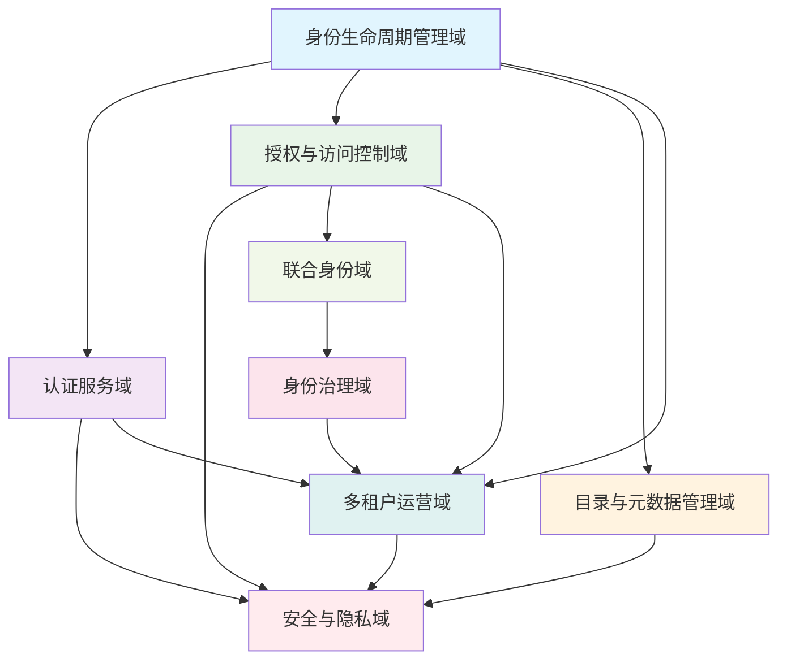
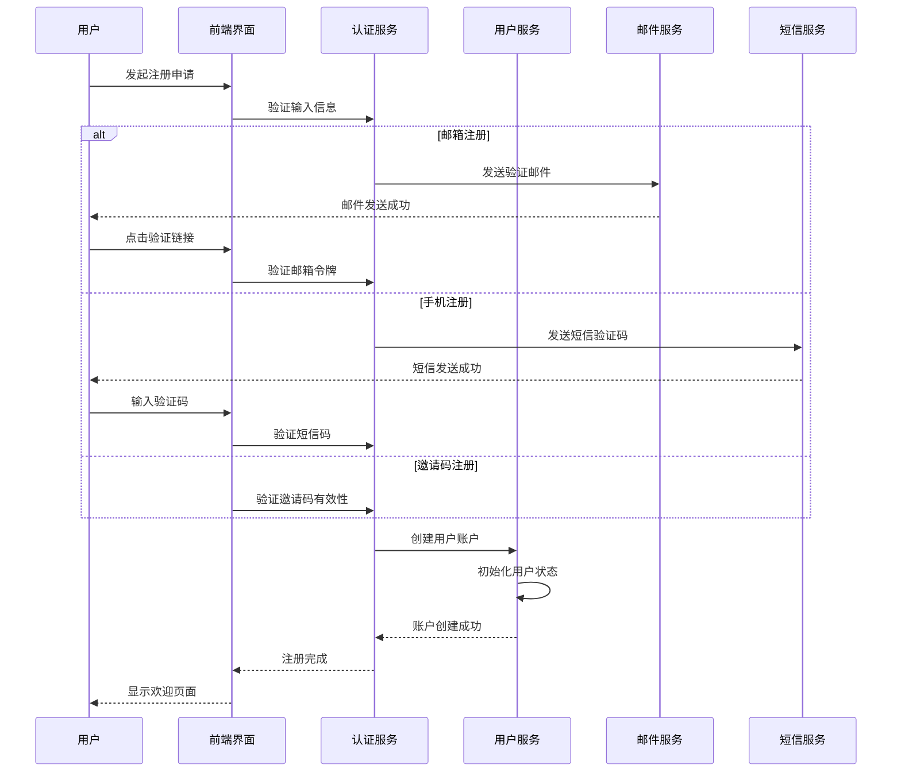
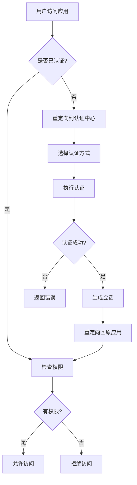
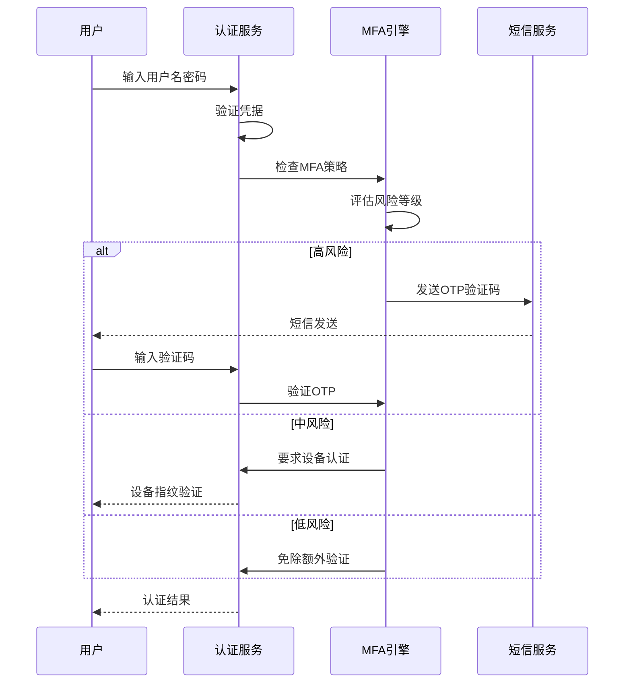
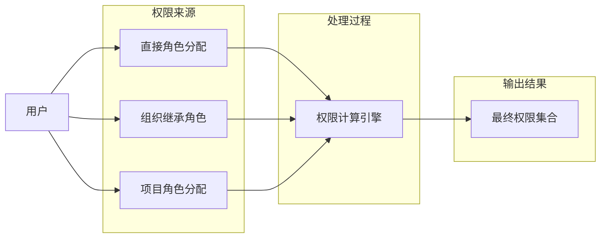

# IDaaS系统业务架构设计文档

## 1. 概述

### 1.1 项目背景
IDaaS（Identity as a Service）系统是为企业提供统一身份认证、授权管理和身份治理服务的核心平台。本系统基于SpringBoot 3.5.10 + Vue3 + MySQL技术栈构建，旨在解决企业在数字化转型过程中面临的身份管理复杂性问题。

### 1.2 设计目标
- 构建统一的身份管理平台，实现用户身份的全生命周期管理
- 提供灵活的认证授权机制，支持多种认证方式和协议
- 建立完善的身份治理体系，满足企业合规要求
- 实现多租户架构，支持不同规模企业的个性化需求

## 2. 业务域划分与交互关系

### 2.1 业务域划分

#### 2.1.1 身份生命周期管理域
**职责范围：**
- 用户账户的创建、激活、停用、锁定、删除等全生命周期管理
- 用户个人资料、扩展属性的维护管理
- 密码策略制定与执行
- 角色权限的分配与继承管理

**关键业务实体：**
```
用户(User) ── 包含基础信息、扩展属性、状态字段
角色(Role) ── 支持层级结构、复合角色定义
权限(Permission) ── 细粒度操作权限定义
组织(Organization) ── 部门树状结构
职位(Position) ── 职务职级管理体系
```

#### 2.1.2 认证服务域
**职责范围：**
- 提供统一认证入口和多种认证方式
- 实现多因子认证体系
- 集成社交登录和企业级认证协议
- 构建自适应认证引擎

**核心功能模块：**
- 统一认证中心
- MFA认证引擎
- 社交登录适配器
- 风险评估引擎
- 会话管理服务

#### 2.1.3 授权与访问控制域
**职责范围：**
- 实现RBAC/ABAC混合权限模型
- 支持主流单点登录协议
- 构建API安全网关
- 实现实时权限计算

**关键技术组件：**
- 权限引擎
- SSO协议处理器
- API网关
- 令牌管理服务

#### 2.1.4 目录与元数据管理域
**职责范围：**
- 用户主数据管理与去重
- 属性扩展与数据质量管理
- 应用目录注册与管理
- 配置生命周期管控

#### 2.1.5 联合身份域
**职责范围：**
- SAML 2.0协议集成
- OIDC/OAuth2.0协议适配
- SCIM 2.0同步机制
- 属性映射与转换

#### 2.1.6 身份治理域
**职责范围：**
- 访问审查与权限盘点
- 合规报告生成
- 权限分析与优化
- AI驱动的权限推荐

#### 2.1.7 安全与隐私域
**职责范围：**
- 数据安全防护
- 隐私保护机制
- 威胁检测与响应
- 行为分析与监控

#### 2.1.8 多租户运营域
**职责范围：**
- 租户管理与数据隔离
- 资源配额控制
- 品牌定制能力
- 运营统计与计费

### 2.2 业务域交互关系图



## 3. 核心业务流程设计

### 3.1 用户注册入职流程

#### 3.1.1 流程概述
用户通过多种渠道（邮箱、手机、邀请码）发起注册申请，系统进行身份验证后创建账户并完成入职流程。

#### 3.1.2 详细流程步骤



#### 3.1.3 业务规则
- 邮箱/手机号必须唯一
- 验证码有效期为15分钟
- 邀请码仅限使用一次
- 新用户默认状态为"待激活"

### 3.2 认证授权流程

#### 3.2.1 统一认证流程



#### 3.2.2 多因子认证流程



### 3.3 权限分配与继承流程

#### 3.3.1 角色权限分配流程



#### 3.3.2 权限继承规则
1. **直接分配优先级最高**
2. **组织继承次之**：用户继承所在部门的角色权限
3. **项目角色补充**：特定项目的临时权限
4. **时间约束生效**：权限的有效期控制
5. **最小权限原则**：去除重复和冗余权限

## 4. 业务规则与约束条件

### 4.1 数据一致性规则

#### 4.1.1 用户数据一致性
```
约束条件：
- 用户名全局唯一
- 邮箱/手机号在激活状态下唯一
- 密码历史记录保留最近12次
- 账户状态变更需记录审计日志
```

#### 4.1.2 组织架构一致性
```
约束条件：
- 部门编码全局唯一
- 组织树深度不超过10层
- 用户必须归属于至少一个部门
- 部门撤销前需处理所有关联用户
```

### 4.2 安全约束条件

#### 4.2.1 认证安全规则
```
密码策略：
- 最小长度：8位字符
- 必须包含大小写字母、数字、特殊字符
- 90天强制更换密码
- 5次错误尝试后账户锁定30分钟

会话管理：
- 默认会话超时：30分钟
- 最大会话数：同一用户5个并发会话
- 异地登录提醒机制
```

#### 4.2.2 权限安全规则
```
权限分配：
- 敏感权限需双重审批
- 权限变更实时生效
- 权限回收需明确原因记录
- 定期进行权限审查（每季度）
```

### 4.3 合规性约束

#### 4.3.1 GDPR合规要求
```
数据主体权利：
- 右忘权：用户可要求删除个人数据
- 数据可移植权：提供标准化数据导出
- 同意管理：明确记录用户同意情况
- 数据泄露通知：72小时内通知监管机构
```

#### 4.3.2 等保2.0要求
```
身份鉴别：
- 三级系统要求双因子认证
- 四级系统要求生物特征认证
- 登录失败处理机制
- 会话超时自动退出
```

## 5. 合规性实现方案

### 5.1 GDPR合规实现

#### 5.1.1 数据保护影响评估(DPIA)
```
评估范围：
- 用户个人数据处理活动
- 数据跨境传输风险
- 第三方数据处理者管理
- 数据泄露应急预案

实施要点：
- 建立数据处理登记册
- 定期更新DPIA报告
- 指定数据保护官(DPO)
- 员工数据保护培训
```

#### 5.1.2 数据主体权利技术实现
```java
// 右忘权实现示例
@Service
public class UserDataDeletionService {
    
    @Transactional
    public void deleteUserPersonalData(Long userId) {
        // 1. 删除用户个人数据
        userRepository.deletePersonalData(userId);
        
        // 2. 清除相关日志中的个人标识
        auditLogRepository.anonymizeUserData(userId);
        
        // 3. 通知第三方系统删除
        thirdPartyIntegrationService.notifyDataDeletion(userId);
        
        // 4. 记录删除操作日志
        auditLogService.recordDeletion(userId, "GDPR右忘权执行");
    }
}
```

### 5.2 等保2.0合规实现

#### 5.2.1 身份鉴别技术措施
```
三级系统要求：
- 用户名+密码+短信验证码
- 登录失败5次锁定账户
- 会话超时15分钟自动退出

四级系统增强：
- 添加生物特征认证（指纹/人脸）
- 设备绑定和信任机制
- 实时风险评估和动态认证
```

#### 5.2.2 访问控制实现
```yaml
# Spring Security配置示例
security:
  authorization:
    # 基于角色的访问控制
    role-based:
      enabled: true
      roles:
        - ADMIN: "*"
        - USER: "read:*"
        - AUDITOR: "audit:*"
    
    # 基于属性的访问控制
    attribute-based:
      enabled: true
      policies:
        - resource: "/api/sensitive/**"
          attributes:
            clearance-level: ">=3"
            department: "security"
```

## 6. 业务可扩展性设计

### 6.1 模块化架构设计

#### 6.1.1 业务模块解耦
```
核心模块：
├── identity-lifecycle    # 身份生命周期管理
├── authentication       # 认证服务
├── authorization        # 授权服务
├── organization         # 组织管理
├── federation           # 联合身份
├── governance           # 身份治理
├── security             # 安全防护
└── operations           # 运营管理

扩展机制：
- 插件化架构支持新认证方式
- 策略模式实现灵活的权限计算
- 事件驱动架构支持业务流程扩展
```

#### 6.1.2 接口标准化
```java
// 认证插件接口定义
public interface AuthenticationPlugin {
    /**
     * 认证处理
     */
    AuthenticationResult authenticate(AuthenticationRequest request);
    
    /**
     * 获取插件信息
     */
    PluginInfo getPluginInfo();
    
    /**
     * 验证配置有效性
     */
    boolean validateConfiguration(Map<String, Object> config);
}

// 权限计算策略接口
public interface PermissionCalculationStrategy {
    /**
     * 计算用户权限
     */
    Set<Permission> calculatePermissions(User user, Context context);
    
    /**
     * 策略优先级
     */
    int getPriority();
}
```

### 6.2 多租户扩展能力

#### 6.2.1 租户隔离机制
```
数据隔离级别：
1. 数据库级别隔离：每个租户独立数据库
2. Schema级别隔离：共享数据库，独立Schema
3. 表级别隔离：共享表，通过tenant_id区分
4. 行级别隔离：细粒度数据行控制

资源配置：
- CPU/Memory配额管理
- 存储空间限制
- API调用频次控制
- 并发用户数限制
```

#### 6.2.2 白标定制能力
```json
{
  "branding": {
    "logo": "https://cdn.example.com/logo.png",
    "primaryColor": "#1976d2",
    "secondaryColor": "#dc004e",
    "loginPageTemplate": "custom-login-template.html",
    "emailTemplates": {
      "verification": "custom-verification-email.html",
      "notification": "custom-notification-email.html"
    }
  },
  "features": {
    "mfaEnabled": true,
    "socialLoginProviders": ["wechat", "dingtalk"],
    "customAttributes": ["employeeId", "departmentCode"]
  }
}
```

## 7. 总结

本业务架构设计文档全面覆盖了IDaaS系统的业务需求，通过八大业务域的合理划分和交互设计，构建了一个完整的企业级身份管理解决方案。设计充分考虑了安全性、合规性、可扩展性等关键要素，为后续的技术架构和系统实现提供了坚实的基础。

### 7.1 关键设计亮点
- **领域驱动设计**：清晰的业务域划分，降低系统复杂度
- **合规内建**：GDPR、等保2.0等法规要求深度集成
- **灵活扩展**：插件化架构支持业务快速迭代
- **安全优先**：多层次安全防护机制

### 7.2 后续工作建议
1. 基于本设计开展详细的需求分析和原型验证
2. 制定分阶段实施路线图
3. 建立持续的架构演进机制
4. 完善相关的管理制度和操作规范