# IDaaS系统数据架构设计文档

## 1. 数据架构概述

### 1.1 设计目标
为IDaaS系统构建高可用、高性能、高安全性的数据架构，支撑企业级身份管理服务。架构需满足：
- 支持百万级用户并发访问
- 保证数据一致性和完整性
- 满足GDPR、等保2.0等合规要求
- 具备良好的可扩展性和维护性

### 1.2 核心设计原则
- **数据一致性**：通过事务和分布式锁保证数据一致性
- **高性能**：合理的索引设计和缓存策略提升查询性能
- **安全性**：敏感数据加密存储，完善的数据访问控制
- **可扩展性**：支持水平扩展和垂直扩展

## 2. 数据库ER图设计

### 2.1 核心实体关系图

```mermaid
erDiagram
    USERS ||--o{ USER_ATTRIBUTES : has
    USERS ||--|| USER_PROFILES : has
    USERS ||--o{ USER_ROLES : assigned
    USERS ||--o{ USER_DEPARTMENTS : belongs
    USERS ||--o{ AUTH_TOKENS : owns
    USERS ||--o{ MFA_FACTORS : configured
    USERS ||--o{ LOGIN_SESSIONS : creates
    USERS ||--o{ USER_TENANTS : member_of
    USERS ||--o{ AUDIT_LOGS : generates
    USERS ||--o{ SECURITY_EVENTS : triggers

    DEPARTMENTS ||--o{ POSITIONS : contains
    DEPARTMENTS ||--o{ USER_DEPARTMENTS : assigns
    POSITIONS ||--o{ USER_DEPARTMENTS : employs

    ROLES ||--o{ ROLE_PERMISSIONS : contains
    PERMISSIONS ||--o{ ROLE_PERMISSIONS : granted
    ROLES ||--o{ USER_ROLES : assigned_to

    APPLICATIONS ||--o{ OAUTH2_CLIENTS : registers
    APPLICATIONS ||--o{ SAML_SERVICE_PROVIDERS : integrates
    APPLICATIONS ||--o{ USER_ROLES : manages

    TENANTS ||--o{ USER_TENANTS : owns
    TENANTS ||--o{ EXTERNAL_SYSTEMS : connects

    EXTERNAL_SYSTEMS ||--o{ USER_SYNC_RECORDS : synchronizes
    USERS ||--o{ USER_SYNC_RECORDS : mapped_to

    %% 核心实体样式
    style USERS fill:#e3f2fd
    style DEPARTMENTS fill:#f3e5f5
    style ROLES fill:#e8f5e8
    style PERMISSIONS fill:#fff3e0
    style APPLICATIONS fill:#fce4ec
    style TENANTS fill:#f1f8e9
```



### 2.2 详细表结构设计

#### 2.2.1 身份数据域

**用户核心表：**
```sql
-- 用户基本信息表
CREATE TABLE users (
    id BIGINT PRIMARY KEY AUTO_INCREMENT COMMENT '用户ID',
    username VARCHAR(64) NOT NULL COMMENT '用户名',
    email VARCHAR(128) COMMENT '邮箱地址',
    mobile VARCHAR(32) COMMENT '手机号码',
    password_hash VARCHAR(255) NOT NULL COMMENT '密码哈希值',
    password_salt VARCHAR(64) NOT NULL COMMENT '密码盐值',
    password_updated_at TIMESTAMP NULL COMMENT '密码最后更新时间',
    status TINYINT NOT NULL DEFAULT 1 COMMENT '账户状态：1-正常，2-锁定，3-停用，4-删除',
    failed_login_attempts INT DEFAULT 0 COMMENT '连续登录失败次数',
    last_login_time TIMESTAMP NULL COMMENT '最后登录时间',
    last_login_ip VARCHAR(64) COMMENT '最后登录IP',
    created_at TIMESTAMP DEFAULT CURRENT_TIMESTAMP COMMENT '创建时间',
    updated_at TIMESTAMP DEFAULT CURRENT_TIMESTAMP ON UPDATE CURRENT_TIMESTAMP COMMENT '更新时间',
    created_by BIGINT COMMENT '创建人ID',
    updated_by BIGINT COMMENT '更新人ID',
    
    -- 约束
    UNIQUE KEY uk_username (username),
    UNIQUE KEY uk_email (email),
    UNIQUE KEY uk_mobile (mobile),
    INDEX idx_status (status),
    INDEX idx_created_at (created_at),
    INDEX idx_last_login (last_login_time),
    
    -- 外键约束
    FOREIGN KEY (created_by) REFERENCES users(id),
    FOREIGN KEY (updated_by) REFERENCES users(id)
) ENGINE=InnoDB DEFAULT CHARSET=utf8mb4 COLLATE=utf8mb4_unicode_ci COMMENT='用户基本信息表';

-- 用户扩展属性表
CREATE TABLE user_attributes (
    id BIGINT PRIMARY KEY AUTO_INCREMENT,
    user_id BIGINT NOT NULL,
    attr_key VARCHAR(64) NOT NULL,
    attr_value LONGTEXT,
    attr_type ENUM('STRING', 'INTEGER', 'BOOLEAN', 'DATE', 'JSON') DEFAULT 'STRING',
    is_sensitive TINYINT DEFAULT 0 COMMENT '是否敏感属性',
    created_at TIMESTAMP DEFAULT CURRENT_TIMESTAMP,
    updated_at TIMESTAMP DEFAULT CURRENT_TIMESTAMP ON UPDATE CURRENT_TIMESTAMP,
    
    UNIQUE KEY uk_user_attr (user_id, attr_key),
    INDEX idx_attr_key (attr_key),
    FOREIGN KEY (user_id) REFERENCES users(id) ON DELETE CASCADE
) ENGINE=InnoDB DEFAULT CHARSET=utf8mb4 COMMENT='用户扩展属性表';

-- 用户档案表
CREATE TABLE user_profiles (
    user_id BIGINT PRIMARY KEY,
    avatar_url VARCHAR(512) COMMENT '头像URL',
    full_name VARCHAR(128) COMMENT '真实姓名',
    nickname VARCHAR(64) COMMENT '昵称',
    gender TINYINT COMMENT '性别：1-男，2-女，0-未知',
    birth_date DATE COMMENT '出生日期',
    id_card VARCHAR(32) COMMENT '身份证号',
    employee_id VARCHAR(64) COMMENT '员工编号',
    hire_date DATE COMMENT '入职日期',
    emergency_contact VARCHAR(64) COMMENT '紧急联系人',
    emergency_phone VARCHAR(32) COMMENT '紧急联系电话',
    created_at TIMESTAMP DEFAULT CURRENT_TIMESTAMP,
    updated_at TIMESTAMP DEFAULT CURRENT_TIMESTAMP ON UPDATE CURRENT_TIMESTAMP,
    
    FOREIGN KEY (user_id) REFERENCES users(id) ON DELETE CASCADE
) ENGINE=InnoDB DEFAULT CHARSET=utf8mb4 COMMENT='用户档案信息表';
```

#### 2.2.2 组织架构数据域

**组织结构表：**
```sql
-- 部门表
CREATE TABLE departments (
    id BIGINT PRIMARY KEY AUTO_INCREMENT,
    dept_code VARCHAR(64) NOT NULL COMMENT '部门编码',
    dept_name VARCHAR(128) NOT NULL COMMENT '部门名称',
    parent_id BIGINT DEFAULT 0 COMMENT '父部门ID，0表示根部门',
    level_path VARCHAR(512) NOT NULL COMMENT '层级路径，如：1/2/3',
    level_depth INT DEFAULT 1 COMMENT '层级深度',
    sort_order INT DEFAULT 0 COMMENT '排序序号',
    manager_id BIGINT COMMENT '部门经理ID',
    description TEXT COMMENT '部门描述',
    status TINYINT DEFAULT 1 COMMENT '状态：1-启用，2-禁用',
    created_at TIMESTAMP DEFAULT CURRENT_TIMESTAMP,
    updated_at TIMESTAMP DEFAULT CURRENT_TIMESTAMP ON UPDATE CURRENT_TIMESTAMP,
    created_by BIGINT,
    updated_by BIGINT,
    
    UNIQUE KEY uk_dept_code (dept_code),
    INDEX idx_parent_id (parent_id),
    INDEX idx_level_path (level_path),
    INDEX idx_status (status),
    FOREIGN KEY (manager_id) REFERENCES users(id),
    FOREIGN KEY (created_by) REFERENCES users(id),
    FOREIGN KEY (updated_by) REFERENCES users(id)
) ENGINE=InnoDB DEFAULT CHARSET=utf8mb4 COMMENT='部门信息表';

-- 职位表
CREATE TABLE positions (
    id BIGINT PRIMARY KEY AUTO_INCREMENT,
    position_code VARCHAR(64) NOT NULL COMMENT '职位编码',
    position_name VARCHAR(128) NOT NULL COMMENT '职位名称',
    dept_id BIGINT NOT NULL COMMENT '所属部门ID',
    level TINYINT COMMENT '职级等级',
    job_grade VARCHAR(32) COMMENT '职级',
    reports_to BIGINT COMMENT '汇报对象职位ID',
    description TEXT COMMENT '职位描述',
    is_manager TINYINT DEFAULT 0 COMMENT '是否管理岗位',
    created_at TIMESTAMP DEFAULT CURRENT_TIMESTAMP,
    updated_at TIMESTAMP DEFAULT CURRENT_TIMESTAMP ON UPDATE CURRENT_TIMESTAMP,
    created_by BIGINT,
    updated_by BIGINT,
    
    UNIQUE KEY uk_position_code (position_code),
    INDEX idx_dept_id (dept_id),
    INDEX idx_reports_to (reports_to),
    FOREIGN KEY (dept_id) REFERENCES departments(id),
    FOREIGN KEY (reports_to) REFERENCES positions(id),
    FOREIGN KEY (created_by) REFERENCES users(id),
    FOREIGN KEY (updated_by) REFERENCES users(id)
) ENGINE=InnoDB DEFAULT CHARSET=utf8mb4 COMMENT='职位信息表';

-- 用户部门关系表
CREATE TABLE user_departments (
    id BIGINT PRIMARY KEY AUTO_INCREMENT,
    user_id BIGINT NOT NULL,
    dept_id BIGINT NOT NULL,
    position_id BIGINT COMMENT '职位ID',
    is_primary TINYINT DEFAULT 1 COMMENT '是否主部门',
    start_date DATE COMMENT '开始日期',
    end_date DATE COMMENT '结束日期',
    created_at TIMESTAMP DEFAULT CURRENT_TIMESTAMP,
    updated_at TIMESTAMP DEFAULT CURRENT_TIMESTAMP ON UPDATE CURRENT_TIMESTAMP,
    created_by BIGINT,
    
    UNIQUE KEY uk_user_dept_period (user_id, dept_id, start_date, end_date),
    INDEX idx_user_id (user_id),
    INDEX idx_dept_id (dept_id),
    FOREIGN KEY (user_id) REFERENCES users(id) ON DELETE CASCADE,
    FOREIGN KEY (dept_id) REFERENCES departments(id),
    FOREIGN KEY (position_id) REFERENCES positions(id),
    FOREIGN KEY (created_by) REFERENCES users(id)
) ENGINE=InnoDB DEFAULT CHARSET=utf8mb4 COMMENT='用户部门关系表';
```

#### 2.2.3 权限数据域

**权限模型表：**
```sql
-- 角色表
CREATE TABLE roles (
    id BIGINT PRIMARY KEY AUTO_INCREMENT,
    role_code VARCHAR(64) NOT NULL COMMENT '角色编码',
    role_name VARCHAR(128) NOT NULL COMMENT '角色名称',
    role_type TINYINT DEFAULT 1 COMMENT '角色类型：1-系统角色，2-自定义角色',
    parent_id BIGINT DEFAULT 0 COMMENT '父角色ID',
    description TEXT COMMENT '角色描述',
    is_builtin TINYINT DEFAULT 0 COMMENT '是否内置角色',
    status TINYINT DEFAULT 1 COMMENT '状态：1-启用，2-禁用',
    created_at TIMESTAMP DEFAULT CURRENT_TIMESTAMP,
    updated_at TIMESTAMP DEFAULT CURRENT_TIMESTAMP ON UPDATE CURRENT_TIMESTAMP,
    created_by BIGINT,
    updated_by BIGINT,
    
    UNIQUE KEY uk_role_code (role_code),
    INDEX idx_parent_id (parent_id),
    INDEX idx_role_type (role_type),
    FOREIGN KEY (created_by) REFERENCES users(id),
    FOREIGN KEY (updated_by) REFERENCES users(id)
) ENGINE=InnoDB DEFAULT CHARSET=utf8mb4 COMMENT='角色信息表';

-- 权限表
CREATE TABLE permissions (
    id BIGINT PRIMARY KEY AUTO_INCREMENT,
    perm_code VARCHAR(128) NOT NULL COMMENT '权限编码',
    perm_name VARCHAR(128) NOT NULL COMMENT '权限名称',
    resource_type VARCHAR(64) COMMENT '资源类型：MENU/API/DATA/OPERATION',
    resource_id VARCHAR(128) COMMENT '资源标识符',
    action VARCHAR(64) COMMENT '操作类型：READ/WRITE/DELETE/ADMIN/EXECUTE',
    description TEXT COMMENT '权限描述',
    is_builtin TINYINT DEFAULT 0 COMMENT '是否内置权限',
    created_at TIMESTAMP DEFAULT CURRENT_TIMESTAMP,
    updated_at TIMESTAMP DEFAULT CURRENT_TIMESTAMP ON UPDATE CURRENT_TIMESTAMP,
    
    UNIQUE KEY uk_perm_code (perm_code),
    INDEX idx_resource_type (resource_type),
    INDEX idx_resource_action (resource_type, resource_id, action)
) ENGINE=InnoDB DEFAULT CHARSET=utf8mb4 COMMENT='权限信息表';

-- 角色权限关联表
CREATE TABLE role_permissions (
    id BIGINT PRIMARY KEY AUTO_INCREMENT,
    role_id BIGINT NOT NULL,
    perm_id BIGINT NOT NULL,
    created_at TIMESTAMP DEFAULT CURRENT_TIMESTAMP,
    created_by BIGINT,
    
    UNIQUE KEY uk_role_perm (role_id, perm_id),
    INDEX idx_role_id (role_id),
    INDEX idx_perm_id (perm_id),
    FOREIGN KEY (role_id) REFERENCES roles(id) ON DELETE CASCADE,
    FOREIGN KEY (perm_id) REFERENCES permissions(id) ON DELETE CASCADE,
    FOREIGN KEY (created_by) REFERENCES users(id)
) ENGINE=InnoDB DEFAULT CHARSET=utf8mb4 COMMENT='角色权限关联表';

-- 用户角色关联表
CREATE TABLE user_roles (
    id BIGINT PRIMARY KEY AUTO_INCREMENT,
    user_id BIGINT NOT NULL,
    role_id BIGINT NOT NULL,
    scope_type TINYINT DEFAULT 1 COMMENT '作用域类型：1-全局，2-部门，3-项目，4-应用',
    scope_id BIGINT COMMENT '作用域ID',
    granted_by BIGINT COMMENT '授权人ID',
    grant_reason TEXT COMMENT '授权原因',
    grant_time TIMESTAMP DEFAULT CURRENT_TIMESTAMP,
    expire_time TIMESTAMP NULL COMMENT '过期时间',
    is_temporary TINYINT DEFAULT 0 COMMENT '是否临时授权',
    created_at TIMESTAMP DEFAULT CURRENT_TIMESTAMP,
    updated_at TIMESTAMP DEFAULT CURRENT_TIMESTAMP ON UPDATE CURRENT_TIMESTAMP,
    
    UNIQUE KEY uk_user_role_scope (user_id, role_id, scope_type, scope_id),
    INDEX idx_user_id (user_id),
    INDEX idx_role_id (role_id),
    INDEX idx_scope (scope_type, scope_id),
    INDEX idx_expire_time (expire_time),
    FOREIGN KEY (user_id) REFERENCES users(id) ON DELETE CASCADE,
    FOREIGN KEY (role_id) REFERENCES roles(id) ON DELETE CASCADE,
    FOREIGN KEY (granted_by) REFERENCES users(id)
) ENGINE=InnoDB DEFAULT CHARSET=utf8mb4 COMMENT='用户角色关联表';
```

#### 2.2.4 认证数据域

**认证相关表：**
```sql
-- 认证令牌表
CREATE TABLE auth_tokens (
    id BIGINT PRIMARY KEY AUTO_INCREMENT,
    user_id BIGINT NOT NULL,
    token_type TINYINT NOT NULL COMMENT '令牌类型：1-Access Token，2-Refresh Token，3-ID Token，4-Device Token',
    token_value VARCHAR(512) NOT NULL COMMENT '令牌值',
    client_id VARCHAR(128) COMMENT '客户端ID',
    scope TEXT COMMENT '权限范围',
    audience TEXT COMMENT '受众',
    expires_at TIMESTAMP NOT NULL COMMENT '过期时间',
    issued_at TIMESTAMP DEFAULT CURRENT_TIMESTAMP COMMENT '签发时间',
    revoked TINYINT DEFAULT 0 COMMENT '是否已撤销：0-未撤销，1-已撤销',
    revoke_reason VARCHAR(255) COMMENT '撤销原因',
    revoked_at TIMESTAMP NULL COMMENT '撤销时间',
    last_used_at TIMESTAMP NULL COMMENT '最后使用时间',
    
    INDEX idx_token_value (token_value(255)),
    INDEX idx_user_expires (user_id, expires_at),
    INDEX idx_client_user (client_id, user_id),
    INDEX idx_revoked (revoked),
    FOREIGN KEY (user_id) REFERENCES users(id) ON DELETE CASCADE
) ENGINE=InnoDB DEFAULT CHARSET=utf8mb4 COMMENT='认证令牌表';

-- 多因子认证表
CREATE TABLE mfa_factors (
    id BIGINT PRIMARY KEY AUTO_INCREMENT,
    user_id BIGINT NOT NULL,
    factor_type TINYINT NOT NULL COMMENT '认证因素类型：1-短信，2-邮箱，3-TOTP，4-硬件令牌，5-生物识别',
    factor_value VARCHAR(255) COMMENT '认证因素值（加密存储）',
    secret_key VARCHAR(255) COMMENT '密钥（加密存储）',
    backup_codes TEXT COMMENT '备用验证码',
    status TINYINT DEFAULT 1 COMMENT '状态：1-启用，2-禁用，3-待验证',
    verified TINYINT DEFAULT 0 COMMENT '是否已验证',
    verified_at TIMESTAMP NULL COMMENT '验证时间',
    last_used_at TIMESTAMP NULL COMMENT '最后使用时间',
    failed_attempts INT DEFAULT 0 COMMENT '失败尝试次数',
    locked_until TIMESTAMP NULL COMMENT '锁定截止时间',
    created_at TIMESTAMP DEFAULT CURRENT_TIMESTAMP,
    updated_at TIMESTAMP DEFAULT CURRENT_TIMESTAMP ON UPDATE CURRENT_TIMESTAMP,
    
    UNIQUE KEY uk_user_factor (user_id, factor_type),
    INDEX idx_status (status),
    FOREIGN KEY (user_id) REFERENCES users(id) ON DELETE CASCADE
) ENGINE=InnoDB DEFAULT CHARSET=utf8mb4 COMMENT='多因子认证表';

-- 登录会话表
CREATE TABLE login_sessions (
    id BIGINT PRIMARY KEY AUTO_INCREMENT,
    session_id VARCHAR(128) NOT NULL COMMENT '会话ID',
    user_id BIGINT NOT NULL,
    client_ip VARCHAR(64) COMMENT '客户端IP',
    user_agent TEXT COMMENT '用户代理',
    device_fingerprint VARCHAR(255) COMMENT '设备指纹',
    device_type VARCHAR(32) COMMENT '设备类型',
    device_os VARCHAR(64) COMMENT '操作系统',
    login_time TIMESTAMP DEFAULT CURRENT_TIMESTAMP COMMENT '登录时间',
    last_access_time TIMESTAMP DEFAULT CURRENT_TIMESTAMP COMMENT '最后访问时间',
    expire_time TIMESTAMP NOT NULL COMMENT '过期时间',
    status TINYINT DEFAULT 1 COMMENT '状态：1-有效，2-过期，3-强制退出',
    logout_time TIMESTAMP NULL COMMENT '登出时间',
    logout_reason VARCHAR(255) COMMENT '登出原因',
    
    UNIQUE KEY uk_session_id (session_id),
    INDEX idx_user_expire (user_id, expire_time),
    INDEX idx_status (status),
    INDEX idx_device_fingerprint (device_fingerprint),
    FOREIGN KEY (user_id) REFERENCES users(id) ON DELETE CASCADE
) ENGINE=InnoDB DEFAULT CHARSET=utf8mb4 COMMENT='登录会话表';
```

## 3. 分库分表策略

### 3.1 分库策略

#### 3.1.1 按业务域分库
```
主库（idaas_master）：
- 用户核心数据（users, user_profiles, user_attributes）
- 组织架构数据（departments, positions, user_departments）
- 权限数据（roles, permissions, role_permissions, user_roles）

认证库（idaas_auth）：
- 认证相关数据（auth_tokens, mfa_factors, login_sessions）
- 审计日志数据（audit_logs, security_events）

应用库（idaas_app）：
- 应用集成数据（applications, oauth2_clients, saml_service_providers）
- 联邦身份数据（external_systems, user_sync_records）

运营库（idaas_ops）：
- 多租户数据（tenants, user_tenants）
- 统计分析数据（各类统计表）
```

#### 3.1.2 读写分离配置
```yaml
# 数据源配置
spring:
  datasource:
    master:
      url: jdbc:mysql://master-db:3306/idaas_master
      username: ${DB_USERNAME}
      password: ${DB_PASSWORD}
      hikari:
        pool-name: MasterHikariCP
        maximum-pool-size: 20
        
    slave:
      url: jdbc:mysql://slave-db:3306/idaas_master
      username: ${DB_USERNAME}
      password: ${DB_PASSWORD}
      hikari:
        pool-name: SlaveHikariCP
        maximum-pool-size: 30
```

### 3.2 分表策略

#### 3.2.1 按时间分表（审计日志）
```sql
-- 审计日志按月分表
CREATE TABLE audit_logs_202401 LIKE audit_logs_template;
CREATE TABLE audit_logs_202402 LIKE audit_logs_template;
CREATE TABLE audit_logs_202403 LIKE audit_logs_template;

-- 分表创建存储过程
DELIMITER //
CREATE PROCEDURE CreateAuditLogTables(IN start_month DATE, IN end_month DATE)
BEGIN
    DECLARE current_month DATE DEFAULT start_month;
    WHILE current_month <= end_month DO
        SET @table_name = CONCAT('audit_logs_', DATE_FORMAT(current_month, '%Y%m'));
        SET @sql = CONCAT('CREATE TABLE ', @table_name, ' LIKE audit_logs_template');
        PREPARE stmt FROM @sql;
        EXECUTE stmt;
        DEALLOCATE PREPARE stmt;
        SET current_month = DATE_ADD(current_month, INTERVAL 1 MONTH);
    END WHILE;
END //
DELIMITER ;
```

#### 3.2.2 按租户分表（多租户场景）
```sql
-- 租户数据分表策略
CREATE TABLE user_tenants_tenant_001 LIKE user_tenants_template;
CREATE TABLE user_tenants_tenant_002 LIKE user_tenants_template;
CREATE TABLE user_tenants_tenant_003 LIKE user_tenants_template;

-- 动态分表路由
public class TenantTableRouting {
    public String getTableName(String baseName, Long tenantId) {
        int tableIndex = (int) (tenantId % 100);
        return String.format("%s_tenant_%03d", baseName, tableIndex);
    }
}
```

## 4. 数据同步与一致性保障

### 4.1 分布式事务处理

#### 4.1.1 本地事务配置
```java
@Service
public class UserService {
    
    @Transactional(rollbackFor = Exception.class)
    public void createUserWithRoles(UserCreateRequest request) {
        // 创建用户
        User user = userMapper.insert(request.getUser());
        
        // 分配角色
        userRoleService.assignRoles(user.getId(), request.getRoleIds());
        
        // 创建用户档案
        userProfileService.createProfile(user.getId(), request.getProfile());
    }
}
```

#### 4.1.2 最终一致性保障
```java
@Component
public class UserEventHandler {
    
    @Autowired
    private TransactionalMessageService messageService;
    
    @EventListener
    @TransactionalEventListener(phase = TransactionPhase.AFTER_COMMIT)
    public void handleUserCreated(UserCreatedEvent event) {
        // 发送异步消息通知其他服务
        messageService.sendAsyncMessage("user-created", event);
    }
    
    @KafkaListener(topics = "user-events")
    public void processUserEvent(ConsumerRecord<String, UserEvent> record) {
        try {
            // 处理用户相关事件
            switch (record.value().getEventType()) {
                case USER_CREATED -> syncToAuthSystem(record.value());
                case USER_UPDATED -> updateAuthUserInfo(record.value());
                case USER_DELETED -> removeAuthUser(record.value());
            }
        } catch (Exception e) {
            // 失败重试机制
            retryService.scheduleRetry(record.value(), e);
        }
    }
}
```

### 4.2 数据同步机制

#### 4.2.1 CDC变更数据捕获
```java
@Component
public class UserCDCListener {
    
    @Autowired
    private KafkaTemplate<String, UserChangeEvent> kafkaTemplate;
    
    @EventListener
    public void handleUserChange(UserChangeEvent event) {
        // 解析binlog事件
        if (event.getEventType() == EventType.UPDATE) {
            User oldUser = event.getBeforeImage();
            User newUser = event.getAfterImage();
            
            // 发送变更事件
            UserSyncEvent syncEvent = UserSyncEvent.builder()
                .userId(newUser.getId())
                .changeType("UPDATE")
                .changedFields(getChangedFields(oldUser, newUser))
                .timestamp(Instant.now())
                .build();
                
            kafkaTemplate.send("user-sync-events", newUser.getId().toString(), syncEvent);
        }
    }
}
```

#### 4.2.2 SCIM同步实现
```java
@Service
public class SCIMSyncService {
    
    public void syncUserToExternalSystem(User user, ExternalSystem system) {
        SCIMUser scimUser = convertToSCIMUser(user);
        
        try {
            SCIMResponse response = scimClient.createUser(system, scimUser);
            if (response.isSuccess()) {
                // 记录同步成功
                syncRecordService.recordSuccess(user.getId(), system.getId(), 
                    response.getExternalUserId());
            } else {
                // 记录同步失败
                syncRecordService.recordFailure(user.getId(), system.getId(), 
                    response.getErrorMessage());
            }
        } catch (Exception e) {
            syncRecordService.recordFailure(user.getId(), system.getId(), e.getMessage());
            throw new SyncException("SCIM同步失败", e);
        }
    }
}
```

## 5. 性能优化方案

### 5.1 索引优化策略

#### 5.1.1 核心查询索引设计
```sql
-- 用户查询优化索引
CREATE INDEX idx_users_status_created ON users(status, created_at);
CREATE INDEX idx_users_email_status ON users(email, status);
CREATE INDEX idx_users_mobile_status ON users(mobile, status);
CREATE INDEX idx_users_last_login ON users(last_login_time DESC);

-- 权限查询优化索引
CREATE INDEX idx_user_roles_user_scope ON user_roles(user_id, scope_type, scope_id);
CREATE INDEX idx_user_roles_expire ON user_roles(expire_time) WHERE expire_time IS NOT NULL;
CREATE INDEX idx_role_permissions_role ON role_permissions(role_id);
CREATE INDEX idx_role_permissions_perm ON role_permissions(perm_id);

-- 认证查询优化索引
CREATE INDEX idx_auth_tokens_user_expire ON auth_tokens(user_id, expires_at) WHERE revoked = 0;
CREATE INDEX idx_auth_tokens_client_user ON auth_tokens(client_id, user_id);
CREATE INDEX idx_login_sessions_user_status ON login_sessions(user_id, status);

-- 组织架构查询优化索引
CREATE INDEX idx_user_departments_user_primary ON user_departments(user_id, is_primary) WHERE end_date IS NULL;
CREATE INDEX idx_departments_parent_status ON departments(parent_id, status);
CREATE INDEX idx_positions_dept ON positions(dept_id);
```

#### 5.1.2 复合索引优化
```sql
-- 复合查询索引
CREATE INDEX idx_audit_logs_user_time ON audit_logs(user_id, log_time DESC);
CREATE INDEX idx_audit_logs_resource_time ON audit_logs(resource_type, resource_id, log_time DESC);
CREATE INDEX idx_security_events_severity_time ON security_events(severity DESC, created_at DESC);

-- 覆盖索引优化
CREATE INDEX idx_users_cover_status ON users(status, username, email, created_at, last_login_time);
CREATE INDEX idx_roles_cover_status ON roles(status, role_code, role_name, created_at);
```

### 5.2 查询优化实践

#### 5.2.1 分页查询优化
```java
@Repository
public interface UserRepository extends JpaRepository<User, Long> {
    
    // 优化的分页查询
    @Query(value = """
        SELECT u.* FROM users u 
        WHERE u.status = :status 
        AND u.id > :lastId
        ORDER BY u.id ASC 
        LIMIT :limit
        """, nativeQuery = true)
    List<User> findUsersByStatusWithCursor(
        @Param("status") Integer status,
        @Param("lastId") Long lastId,
        @Param("limit") Integer limit
    );
    
    // 统计查询优化
    @Query("""
        SELECT new com.qoobot.openidaas.dto.UserStatsDTO(
            COUNT(u), 
            COUNT(CASE WHEN u.status = 1 THEN 1 END),
            COUNT(CASE WHEN u.lastLoginTime > :recentTime THEN 1 END)
        ) FROM User u WHERE u.createdAt >= :startTime
        """)
    UserStatsDTO getUserStatistics(
        @Param("startTime") LocalDateTime startTime,
        @Param("recentTime") LocalDateTime recentTime
    );
}
```

#### 5.2.2 批量操作优化
```java
@Service
@Transactional
public class BatchUserService {
    
    @Autowired
    private UserMapper userMapper;
    
    public void batchInsertUsers(List<User> users) {
        // 批量插入优化
        SqlSession sqlSession = sqlSessionFactory.openSession(ExecutorType.BATCH);
        try {
            UserMapper batchMapper = sqlSession.getMapper(UserMapper.class);
            for (int i = 0; i < users.size(); i++) {
                batchMapper.insert(users.get(i));
                if (i % 1000 == 0) {
                    sqlSession.flushStatements();
                }
            }
            sqlSession.flushStatements();
            sqlSession.commit();
        } finally {
            sqlSession.close();
        }
    }
    
    public void batchUpdateUserStatus(List<Long> userIds, Integer status) {
        // 批量更新优化
        userMapper.batchUpdateStatus(userIds, status, Instant.now());
    }
}
```

## 6. 数据安全与合规性设计

### 6.1 数据加密保护

#### 6.1.1 敏感数据加密存储
```java
@Component
public class DataEncryptionService {
    
    @Value("${app.encryption.key}")
    private String encryptionKey;
    
    private final AESUtil aesUtil = new AESUtil();
    
    public String encryptSensitiveData(String plainText) {
        if (StringUtils.isEmpty(plainText)) {
            return plainText;
        }
        return aesUtil.encrypt(plainText, encryptionKey);
    }
    
    public String decryptSensitiveData(String encryptedText) {
        if (StringUtils.isEmpty(encryptedText)) {
            return encryptedText;
        }
        return aesUtil.decrypt(encryptedText, encryptionKey);
    }
    
    // 数据库字段加密注解
    @Target({ElementType.FIELD})
    @Retention(RetentionPolicy.RUNTIME)
    public @interface Encrypted {
    }
}

@Entity
@Table(name = "user_profiles")
public class UserProfile {
    
    @Encrypted
    @Column(name = "id_card")
    private String idCard;
    
    @Encrypted
    @Column(name = "emergency_phone")
    private String emergencyPhone;
}
```

#### 6.1.2 数据脱敏处理
```java
@Component
public class DataMaskingService {
    
    public String maskMobile(String mobile) {
        if (mobile == null || mobile.length() != 11) {
            return mobile;
        }
        return mobile.substring(0, 3) + "****" + mobile.substring(7);
    }
    
    public String maskEmail(String email) {
        if (email == null || !email.contains("@")) {
            return email;
        }
        String[] parts = email.split("@");
        if (parts[0].length() <= 2) {
            return "***@" + parts[1];
        }
        return parts[0].substring(0, 2) + "***@" + parts[1];
    }
    
    public UserDTO maskUserData(User user) {
        UserDTO dto = new UserDTO();
        BeanUtils.copyProperties(user, dto);
        dto.setMobile(maskMobile(user.getMobile()));
        dto.setEmail(maskEmail(user.getEmail()));
        return dto;
    }
}
```

### 6.2 访问控制与审计

#### 6.2.1 数据库访问控制
```java
@Configuration
public class DatabaseSecurityConfig {
    
    @Bean
    public DataSource dataSource() {
        HikariDataSource dataSource = new HikariDataSource();
        dataSource.setJdbcUrl(env.getProperty("spring.datasource.url"));
        dataSource.setUsername(env.getProperty("spring.datasource.username"));
        
        // 最小权限原则
        dataSource.setPassword(getEncryptedPassword());
        
        // 连接池安全配置
        dataSource.setMaximumPoolSize(20);
        dataSource.setConnectionTimeout(30000);
        dataSource.setIdleTimeout(600000);
        dataSource.setMaxLifetime(1800000);
        
        return dataSource;
    }
    
    // 数据权限过滤器
    @Component
    public class DataPermissionInterceptor implements Interceptor {
        
        @Override
        public Object intercept(Invocation invocation) throws Throwable {
            StatementHandler statementHandler = (StatementHandler) invocation.getTarget();
            MetaObject metaObject = MetaObject.forObject(statementHandler, 
                DEFAULT_OBJECT_FACTORY, DEFAULT_OBJECT_WRAPPER_FACTORY, new DefaultReflectorFactory());
            
            String sql = statementHandler.getBoundSql().getSql();
            
            // 添加数据权限过滤条件
            if (shouldApplyDataPermission(sql)) {
                String filteredSql = addDataPermissionFilter(sql);
                metaObject.setValue("delegate.boundSql.sql", filteredSql);
            }
            
            return invocation.proceed();
        }
    }
}
```

#### 6.2.2 完整审计日志
```java
@Aspect
@Component
public class AuditLogAspect {
    
    @Autowired
    private AuditLogService auditLogService;
    
    @Around("@annotation(audit)")
    public Object auditOperation(ProceedingJoinPoint joinPoint, Audit audit) throws Throwable {
        AuditContext context = AuditContext.builder()
            .userId(SecurityContextHolder.getContext().getAuthentication().getName())
            .operation(audit.operation())
            .resourceType(audit.resourceType())
            .timestamp(Instant.now())
            .build();
            
        try {
            Object result = joinPoint.proceed();
            context.setStatus("SUCCESS");
            auditLogService.recordAudit(context);
            return result;
        } catch (Exception e) {
            context.setStatus("FAILED");
            context.setErrorMessage(e.getMessage());
            auditLogService.recordAudit(context);
            throw e;
        }
    }
}

// 审计注解定义
@Target(ElementType.METHOD)
@Retention(RetentionPolicy.RUNTIME)
public @interface Audit {
    String operation();
    String resourceType();
}
```

### 6.3 合规性保障措施

#### 6.3.1 GDPR合规实现
```java
@Service
public class GDPRComplianceService {
    
    @Transactional
    public void handleDataSubjectRequest(DataSubjectRequest request) {
        switch (request.getRequestType()) {
            case RIGHT_TO_ACCESS -> provideDataAccess(request);
            case RIGHT_TO_RECTIFICATION -> rectifyPersonalData(request);
            case RIGHT_TO_ERASURE -> erasePersonalData(request);
            case RIGHT_TO_DATA_PORTABILITY -> exportPersonalData(request);
            case RIGHT_TO_RESTRICT_PROCESSING -> restrictDataProcessing(request);
        }
    }
    
    public void erasePersonalData(DataSubjectRequest request) {
        Long userId = request.getUserId();
        
        // 1. 删除用户个人数据
        userMapper.deletePersonalData(userId);
        
        // 2. 匿名化相关日志
        auditLogMapper.anonymizeUserData(userId);
        
        // 3. 通知第三方系统
        thirdPartyService.notifyDataErasure(userId);
        
        // 4. 记录删除操作
        complianceLogService.recordErasure(userId, request.getRequestId());
    }
}
```

#### 6.3.2 等保2.0合规措施
```java
@Component
public class SecurityComplianceChecker {
    
    // 身份鉴别检查
    public SecurityCheckResult checkIdentityAuthentication() {
        return SecurityCheckResult.builder()
            .checkItem("身份鉴别")
            .requirementLevel("三级")
            .currentStatus(checkMFAStatus())
            .complianceScore(calculateAuthComplianceScore())
            .recommendations(getAuthImprovementSuggestions())
            .build();
    }
    
    // 访问控制检查
    public SecurityCheckResult checkAccessControl() {
        return SecurityCheckResult.builder()
            .checkItem("访问控制")
            .requirementLevel("三级")
            .currentStatus(checkPermissionModel())
            .complianceScore(calculateAccessControlScore())
            .findings(getAccessControlIssues())
            .build();
    }
}
```

## 7. 高可用与备份策略

### 7.1 数据库高可用设计

#### 7.1.1 主从复制配置
```sql
-- 主库配置
[mysqld]
server-id = 1
log-bin = mysql-bin
binlog-format = ROW
sync_binlog = 1
innodb_flush_log_at_trx_commit = 1

-- 从库配置
[mysqld]
server-id = 2
relay-log = relay-bin
read_only = 1
slave-skip-errors = ddl_exist_errors

-- 启动复制
CHANGE MASTER TO
MASTER_HOST='master-host',
MASTER_USER='repl_user',
MASTER_PASSWORD='repl_password',
MASTER_LOG_FILE='mysql-bin.000001',
MASTER_LOG_POS=154;

START SLAVE;
```

#### 7.1.2 故障自动切换
```yaml
# Orchestrator配置
{
  "MySQLTopologyUser": "orchestrator",
  "MySQLTopologyPassword": "orchestrator_password",
  "MySQLReplicaUser": "repl_user",
  "MySQLReplicaPassword": "repl_password",
  "RecoveryPeriodBlockSeconds": 3600,
  "FailMasterPromotionIfSQLThreadNotUpToDate": true,
  "DelayMasterPromotionIfSQLThreadNotUpToDate": true,
  "DetachLostSlavesAfterMasterFailover": true
}
```

### 7.2 备份与恢复策略

#### 7.2.1 自动备份方案
```bash
#!/bin/bash
# MySQL自动备份脚本

BACKUP_DIR="/backup/mysql"
DATE=$(date +%Y%m%d_%H%M%S)
MYSQL_USER="backup_user"
MYSQL_PASSWORD="backup_password"

# 全量备份
mysqldump -u$MYSQL_USER -p$MYSQL_PASSWORD \
    --single-transaction \
    --routines \
    --triggers \
    --all-databases \
    --master-data=2 \
    --flush-logs \
    > $BACKUP_DIR/full_backup_$DATE.sql

# 压缩备份文件
gzip $BACKUP_DIR/full_backup_$DATE.sql

# 增量备份（binlog）
mysqlbinlog --read-from-remote-server \
    --host=localhost \
    --user=$MYSQL_USER \
    --password=$MYSQL_PASSWORD \
    --raw \
    --stop-never \
    mysql-bin.* \
    > $BACKUP_DIR/binlog_$DATE.log

# 清理旧备份（保留30天）
find $BACKUP_DIR -name "*.sql.gz" -mtime +30 -delete
find $BACKUP_DIR -name "*.log" -mtime +7 -delete
```

#### 7.2.2 灾难恢复计划
```java
@Component
public class DisasterRecoveryService {
    
    @Scheduled(cron = "0 0 2 * * ?") // 每天凌晨2点执行
    public void performDisasterRecoveryTest() {
        // 1. 检查备份完整性
        backupValidationService.validateBackups();
        
        // 2. 执行恢复演练
        recoveryTestService.executeRecoveryTest();
        
        // 3. 验证数据一致性
        dataConsistencyService.checkConsistency();
        
        // 4. 生成恢复报告
        recoveryReportService.generateReport();
    }
    
    public RecoveryPlan createRecoveryPlan(FailureScenario scenario) {
        return RecoveryPlan.builder()
            .scenario(scenario)
            .recoverySteps(getRecoverySteps(scenario))
            .estimatedTime(getEstimatedRecoveryTime(scenario))
            .requiredResources(getRequiredResources(scenario))
            .rollbackPlan(getRollbackPlan(scenario))
            .build();
    }
}
```

## 8. 总结

本数据架构设计文档为IDaaS系统提供了完整的企业级数据解决方案，通过合理的表结构设计、分库分表策略、性能优化措施和安全合规保障，构建了一个高可用、高性能、高安全性的数据架构体系。

### 8.1 核心优势
- **高性能**：通过索引优化、分库分表、读写分离等手段提升系统性能
- **高可用**：主从复制、故障自动切换、完善的备份恢复机制
- **高安全**：数据加密、访问控制、完整审计、合规保障
- **易扩展**：模块化设计、松耦合架构、支持水平扩展

### 8.2 实施建议
1. 分阶段实施，优先核心业务数据表
2. 建立完善的监控和告警机制
3. 定期进行性能调优和安全评估
4. 制定详细的数据治理规范和操作手册